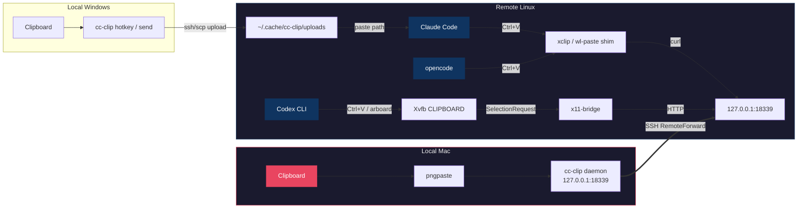

<!-- i18n-source: README.md @ d15a990 -->

<p align="center">
  <a href="README.md">English</a> ·
  <a href="README.zh-CN.md">简体中文</a> ·
  <b>日本語</b>
</p>

<p align="center">
  
</p>
<h1 align="center">cc-clip</h1>
<p align="center">
  <b>Claude Code、Codex CLI、opencode で SSH 越しに画像を貼り付け、Claude Code と Codex CLI にデスクトップ通知を届けます。</b>
</p>
<p align="center">
  <a href="https://github.com/ShunmeiCho/cc-clip/releases"></a>
  <a href="LICENSE"></a>
  <a href="https://go.dev"></a>
  <a href="https://github.com/ShunmeiCho/cc-clip/stargazers"></a>
</p>

<p align="center">
  
  <br>
  <em>インストール → セットアップ → 貼り付け。クリップボードが SSH 越しに動きます。</em>
</p>

> これは英語版 README の日本語訳です。内容に差異がある場合は [English README](README.md) を正とします。この翻訳は英語版のメインラインより遅れている場合があります。
>
> *This is the Japanese translation of the English README. If any content differs, the [English README](README.md) is authoritative. This translation may lag behind the English main line.*

---

<details>
<summary><b>目次</b></summary>

- [問題](#問題)
- [解決策](#解決策)
- [前提条件](#前提条件)
- [クイックスタート](#クイックスタート)
- [なぜ cc-clip か](#なぜ-cc-clip-か)
- [仕組み](#仕組み)
- [SSH 通知](#ssh-通知)
- [セキュリティ](#セキュリティ)
- [日常の使い方](#日常の使い方)
- [コマンド](#コマンド)
- [設定](#設定)
- [プラットフォーム対応](#プラットフォーム対応)
- [要件](#要件)
- [トラブルシューティング](#トラブルシューティング)
- [コントリビュート](#コントリビュート)
- [関連 Issue](#関連-issue)
- [ライセンス](#ライセンス)

</details>

---

## 問題

SSH 経由でリモートサーバー上の Claude Code、Codex CLI、opencode を使うと、**画像貼り付けがうまく動かない**ことがよくあり、**通知も手元に届きません**。リモート側のクリップボードは空です。スクリーンショットも図も渡せません。coding agent が作業を終えたり承認を求めたりしても、ターミナルを見続けていない限り気づけません。

## 解決策

```text
画像貼り付け:
  Claude Code (macOS):   Mac clipboard     → cc-clip daemon → SSH tunnel → xclip shim        → Claude Code
  Claude Code (Windows): Windows clipboard → cc-clip hotkey → SSH/SCP    → remote file path  → Claude Code
  Codex CLI:             Mac clipboard     → cc-clip daemon → SSH tunnel → x11-bridge/Xvfb   → Codex CLI
  opencode:              Mac clipboard     → cc-clip daemon → SSH tunnel → xclip/wl-paste shim → opencode

通知 (Claude Code + Codex CLI):
  Claude Code hook → cc-clip-hook → SSH tunnel → local daemon → macOS/cmux notification
  Codex notify     → cc-clip notify             → SSH tunnel → local daemon → macOS/cmux notification
```

ひとつのツールで済みます。Claude Code、Codex、opencode の変更は不要です。3 つすべてでクリップボードが使え、通知は Claude Code と Codex CLI 向けに配線されています。

## 前提条件

- **ローカルマシン:** macOS 13+ または Windows 10/11
- **リモートサーバー:** SSH でアクセスできる Linux（amd64 または arm64）
- **SSH config:** リモートサーバー用の Host エントリが `~/.ssh/config` に必要です

SSH config エントリがまだない場合は、次のように追加します。

```
# ~/.ssh/config
Host myserver
    HostName 10.0.0.1       # your server's IP or domain
    User your-username
    IdentityFile ~/.ssh/id_rsa  # optional, if using key auth
```

Windows で SSH/Claude Code ワークフローを使う場合は、専用ガイドを参照してください。

- [Windows Quick Start](docs/windows-quickstart.md)

## クイックスタート

### Step 1: cc-clip をインストールする

macOS / Linux:

```bash
curl -fsSL https://raw.githubusercontent.com/ShunmeiCho/cc-clip/main/scripts/install.sh | sh
```

Windows:

専用ガイドを参照してください。

- [Windows Quick Start](docs/windows-quickstart.md)

> **Windows support is experimental.** v0.6.0 では hotkey-conflict validation fix が入っています。clipboard persistence hardening は、実際の Windows ホスト上でまだ検証中です（[#30](https://github.com/ShunmeiCho/cc-clip/pull/30) で追跡）。

macOS / Linux では、案内が出た場合 `~/.local/bin` を PATH に追加してください。

```bash
# shell profile（~/.zshrc または ~/.bashrc）に追加
export PATH="$HOME/.local/bin:$PATH"

# shell を再読み込み
source ~/.zshrc  # または: source ~/.bashrc
```

インストールを確認します。

```bash
cc-clip --version
```

> **macOS の “killed” エラー?** `zsh: killed cc-clip` が出る場合、macOS Gatekeeper がバイナリをブロックしています。修正: `xattr -d com.apple.quarantine ~/.local/bin/cc-clip`

### Step 2: セットアップする（1 コマンド）

```bash
cc-clip setup myserver
```

この 1 コマンドですべて処理します。
1. ローカル依存（`pngpaste`）をインストール
2. SSH を設定（`RemoteForward`、`ControlMaster no`）
3. ローカル daemon を起動（macOS launchd 経由）
4. バイナリと shim をリモートサーバーへデプロイ

<details>
<summary>動作を見る（macOS）</summary>
<p align="center">
  
</p>
</details>

#### どの setup コマンドを実行すればよいですか？

使っているリモートワークフローに合う行を選んでください。決めることはこれだけです。

| リモート CLI | コマンド | 追加されるもの | リモート `sudo` は必要？ |
|---|---|---|---|
| Claude Code のみ | `cc-clip setup myserver` | xclip / wl-paste shim | ❌ 不要 |
| Claude Code + Codex CLI | `cc-clip setup myserver --codex` | shim **に加えて**リモートの Xvfb + x11-bridge（下記参照） | ✅ **必要** — `apt`/`dnf install xvfb` 用の passwordless `sudo`、または事前に手動インストール |
| opencode のみ | `cc-clip setup myserver` | shim のみ — opencode は Claude Code と同じ xclip / wl-paste 経路でクリップボードを読むため、`--codex` は不要です |
| Windows ローカルマシン | [Windows Quick Start](docs/windows-quickstart.md) を参照 | 別ワークフロー — `--codex` は使いません | ❌ 不要 |

> **`--codex` の前提条件**（上の表で唯一 `sudo` が必要な行）: リモートに Xvfb がインストールされている必要があります。`cc-clip setup --codex` は `sudo apt install xvfb`（Debian/Ubuntu）または `sudo dnf install xorg-x11-server-Xvfb`（RHEL/Fedora）を自動実行しようとします。ただし passwordless `sudo` がない場合は中断し、手動で実行すべき正確なコマンドを表示します。Xvfb をインストールした後、`cc-clip setup myserver --codex` を再実行してください。
>
> リモートで passwordless `sudo` も一度きりの手動インストールも許可されていない場合は、`cc-clip setup myserver`（`--codex` なし）を使ってください。Claude Code と opencode のクリップボード貼り付けはそのまま動きます。Xvfb が必要なのは Codex CLI 経路だけです。

> **目安:** リモートで本当に Codex CLI を動かす場合だけ `--codex` を使ってください。それ以外では不要なオーバーヘッドです。

### Step 3（Codex CLI のみ）: `--codex` が追加するもの

Codex CLI は `xclip` を呼び出すのではなく、`arboard` crate を通じて X11 から直接クリップボードを読みます。そのため透過 shim では intercept できません。`--codex` はその差分を埋めるため、リモート側に次を追加します。

1. **Xvfb** — headless X server です。**`sudo` が必要です:** passwordless `sudo` がある場合、`cc-clip` は `sudo apt install xvfb` または `sudo dnf install xorg-x11-server-Xvfb` を自動で試します。ない場合は、手動で実行する正確なコマンドを表示して中断します。その後 `cc-clip setup myserver --codex` を再実行してください。
2. **`cc-clip x11-bridge`** — Xvfb のクリップボードを所有し、必要に応じて画像データを提供するバックグラウンドプロセスです。画像は Claude Code 経路と同じ SSH tunnel 経由で取得されます。
3. **`DISPLAY=127.0.0.1:N`** — リモートの shell rc に注入され、次に起動する Codex プロセスが自動的に拾います。（Unix socket の `:N` 形式ではなく TCP-loopback 形式です。Codex CLI の sandbox は `/tmp/.X11-unix/` へのアクセスをブロックするためです。）

Codex 貼り付けを使うだけなら、これらを理解する必要はありません。`--codex` がサーバー上で何を触るのか、あとでどう診断するのかを見えるようにしているだけです。

<details>
<summary>Windows ローカルの場合は専用ガイドを使ってください</summary>

- [Windows Quick Start](docs/windows-quickstart.md)

<p align="center">
  
</p>

注意: Windows ワークフローは `--codex` と無関係です。Windows ローカルマシンは SCP で画像をアップロードします。ローカル側に Xvfb 経路はありません。

</details>

### Step 4: 接続して使う

サーバーへ**新しい** SSH セッションを開きます（tunnel は SSH 接続時に有効化されます）。

```bash
ssh myserver
```

あとは通常どおり Claude Code、Codex CLI、opencode を使ってください。`Ctrl+V`（または agent が割り当てているクリップボード貼り付けキー）で、Mac のクリップボードから画像を貼り付けられます。

> **重要:** 画像貼り付けは SSH tunnel 経由で動きます。必ず設定した host である `ssh myserver` から接続してください。tunnel は各 SSH 接続ごとに確立されます。

### 動作確認

ローカルマシンからの汎用エンドツーエンドチェックです（Claude Code、Codex、opencode で使えます）。

```bash
# 先に Mac のクリップボードへ画像をコピーします（Cmd+Shift+Ctrl+4）。その後:
cc-clip doctor --host myserver
```

#### Codex 専用の確認

`--codex` を使った場合、リモートサーバー上で次の 4 コマンドを実行すると Codex 専用コンポーネントの状態を確認できます。先に Mac で画像をコピーしてから SSH してください。

```bash
ssh myserver

# 1. DISPLAY が注入されている
echo $DISPLAY                   # 期待値: 127.0.0.1:0（または :1, :2, …）

# 2. Xvfb が動作している
ps aux | grep Xvfb | grep -v grep

# 3. x11-bridge が動作している
ps aux | grep 'cc-clip x11-bridge' | grep -v grep

# 4. クリップボードのネゴシエーションがエンドツーエンドで動く
xclip -selection clipboard -t TARGETS -o    # 期待値: image/png
```

どれかが失敗する場合、最も一般的な修正はローカルマシンから `cc-clip connect myserver --codex --force` を実行することです。完全な手順は [トラブルシューティング](#トラブルシューティング) →「Ctrl+V で画像を貼り付けられない（Codex CLI）」を参照してください。

### `setup` と `connect` — いつどちらを使うか

覚えるべき操作は 3 つだけです。リモートで Codex CLI を使う場合は、下の `setup` または `connect` コマンドに `--codex` を追加してください。使わない場合は省略します。

| 状況 | コマンド（Claude Code のみ） | コマンド（Codex CLI も使う場合） |
|---|---|---|
| **この host で初回インストール** | `cc-clip setup myserver` | `cc-clip setup myserver --codex` |
| **状態が壊れている**（DISPLAY が空、x11-bridge がない、tunnel の probe が通らない） | `cc-clip connect myserver --force` | `cc-clip connect myserver --codex --force` |
| **Daemon が token をローテートし、リモートが古い token のまま** | `cc-clip connect myserver --token-only` | `cc-clip connect myserver --token-only` |

`setup` は初回パスです（依存関係 + SSH config + daemon + deploy）。`connect` は修復/再デプロイ用のパスです。deploy 手順は同じですが、SSH config とローカル daemon はすでにあるものとして扱います。

Windows での同等のクイックチェックはこちらです。

- [Windows Quick Start](docs/windows-quickstart.md)

## なぜ cc-clip か

| 方法 | SSH 越しに動く？ | 任意のターミナル？ | 画像対応？ | セットアップの複雑さ |
|----------|:-:|:-:|:-:|:--:|
| Native Ctrl+V | ローカルのみ | 一部 | Yes | なし |
| X11 Forwarding | Yes（遅い） | N/A | Yes | 複雑 |
| OSC 52 clipboard | 一部 | 一部 | テキストのみ | なし |
| **cc-clip** | **Yes** | **Yes** | **Yes** | **1 コマンド** |

## 仕組み



1. **macOS Claude path:** ローカル daemon が `pngpaste` で Mac のクリップボードを読み、loopback 上の HTTP で画像を提供します。リモートの `xclip` / `wl-paste` shim は SSH tunnel 経由で画像を取得します。
2. **opencode path:** Claude Code path と同じ shim です。opencode は `xclip`（X11）または `wl-paste`（Wayland）でクリップボードを読むため、cc-clip の shim が Mac クリップボードを透過的に提供します。opencode 固有の設定は不要です。
3. **Windows Claude path:** ローカル hotkey が Windows クリップボードを読み、SSH/SCP で画像をアップロードし、リモートファイルパスをアクティブなターミナルへ貼り付けます。
4. **Codex CLI path:** x11-bridge が headless Xvfb 上の CLIPBOARD を所有し、Codex が X11 経由でクリップボードを読むときにオンデマンドで画像を提供します（`arboard` crate 経由です。`xclip` のようには shim intercept できません）。
5. **Notification path:** リモートの Claude Code hooks と Codex notify イベントは、`cc-clip-hook` → SSH tunnel → ローカル daemon → macOS Notification Center または cmux へ流れます。

## SSH 通知

リモート hook イベント（Claude の完了、ツール承認リクエスト、画像貼り付けイベント、Codex タスク完了）は、クリップボードと同じ SSH tunnel を通ってローカルマシンに届き、macOS / cmux のネイティブ通知として表示されます。これにより、`TERM_PROGRAM` が転送されない、リモートに `terminal-notifier` がない、tmux が OSC シーケンスを飲み込む、といった SSH 通知の典型的な失敗を避けられます。

| イベント | 通知 |
|-------|-------------|
| Claude が応答を完了 | “Claude stopped” + 最後のメッセージプレビュー |
| Claude がツール承認を要求 | “Tool approval needed” + ツール名 |
| Codex タスク完了 | “Codex” + 完了メッセージ |
| Ctrl+V で画像貼り付け | “cc-clip #N” + フィンガープリント + サイズ |

**CLI ごとの対応範囲:**

| CLI | `cc-clip connect` で自動設定される？ |
|-----|----------------------------------------|
| Codex CLI | ✅ リモートに `~/.codex/` がある場合 |
| Claude Code | ⚠️ 手動 — `cc-clip-hook` を `~/.claude/settings.json` に追加 |
| opencode | ❌ まだ out-of-the-box では未対応 |

完全なセットアップ、Claude Code の手動設定、nonce 登録、トラブルシューティングは **[docs/notifications.md](docs/notifications.md)** を参照してください。

## セキュリティ

| レイヤー | 保護 |
|-------|-----------|
| ネットワーク | loopback のみ（`127.0.0.1`）— 外部には公開されません |
| クリップボード認証 | Bearer token、30 日の sliding expiration（使用時に自動延長） |
| 通知認証 | connect ごとに専用 nonce（クリップボード token とは別） |
| Token 配布 | stdin 経由。コマンドライン引数には出しません |
| 通知の信頼性 | Hook 通知は `verified` として扱われます。generic JSON はタイトルに `[unverified]` prefix が付きます |
| 透過性 | 画像以外の呼び出しは実際の `xclip` へそのまま渡されます |

## 日常の使い方

初期セットアップ後の日常ワークフローは次のとおりです。

```bash
# 1. サーバーへ SSH する（tunnel は自動で有効化）
ssh myserver

# 2. Claude Code または Codex CLI を通常どおり使う
claude          # Claude Code
codex           # Codex CLI

# 3. Ctrl+V で Mac クリップボードから画像を貼り付ける
```

ローカル daemon は macOS launchd service として動作し、ログイン時に自動起動します。setup を再実行する必要はありません。

### Windows ワークフロー

Windows では、`Windows Terminal -> SSH -> tmux -> Claude Code` の組み合わせによっては、`Alt+V` や `Ctrl+V` を押してもリモートの `xclip` 経路が発火しません。そのため `cc-clip` は、リモートのクリップボード intercept に依存しない Windows-native ワークフローを提供します。

初回セットアップと日常利用については、次を参照してください。

- [Windows Quick Start](docs/windows-quickstart.md)

Windows ワークフローは専用の remote-paste hotkey（デフォルト: `Alt+Shift+V`）を使うため、ローカル Claude Code のネイティブ `Alt+V` と衝突しません。

## コマンド

実際によく使う 10 個です。

| コマンド | 説明 |
|---------|-------------|
| `cc-clip setup <host>` | **完全セットアップ**: deps、SSH config、daemon、deploy |
| `cc-clip setup <host> --codex` | Codex CLI support を含む完全セットアップ |
| `cc-clip connect <host> --force` | 修復/再デプロイ（DISPLAY、x11-bridge、tunnel が詰まった場合） |
| `cc-clip connect <host> --token-only` | バイナリを再デプロイせず、ローテート済み token だけを同期 |
| `cc-clip doctor --host <host>` | エンドツーエンド health check |
| `cc-clip status` | ローカルコンポーネントの状態を表示 |
| `cc-clip service install` / `service uninstall` | macOS launchd daemon の自動起動を管理 |
| `cc-clip notify --title T --body B` | tunnel 経由で generic notification を送信 |
| `cc-clip send [<host>] --paste` | Windows: クリップボード画像をアップロードし、リモートパスを貼り付け |
| `cc-clip hotkey [<host>]` | Windows: remote upload/paste hotkey を登録 |

すべての flag と環境変数を含む完全なコマンドリファレンスは **[docs/commands.md](docs/commands.md)** を参照してください。インストール済みバージョンの正確な一覧は `cc-clip --help` で確認できます。

## 設定

すべての設定には妥当なデフォルトがあります。環境変数で上書きできます。完全な一覧は [docs/commands.md](docs/commands.md#environment-variables) を参照してください。

| 設定 | デフォルト | 環境変数 |
|---------|---------|---------|
| Port | 18339 | `CC_CLIP_PORT` |
| Token TTL | 30d | `CC_CLIP_TOKEN_TTL` |
| Debug logs | off | `CC_CLIP_DEBUG=1` |

## プラットフォーム対応

| ローカル | リモート | 状態 |
|-------|--------|--------|
| macOS (Apple Silicon) | Linux (amd64) | Stable |
| macOS (Intel) | Linux (arm64) | Stable |
| Windows 10/11 | Linux (amd64/arm64) | Experimental (`send` / `hotkey`) |

### 対応しているリモート CLI

cc-clip は、Linux 上で `xclip` または `wl-paste` を使ってクリップボードを読む **任意の coding agent** で動きます。CLI ごとの設定は不要です。透過 shim が、これらのバイナリを呼び出すプロセスのクリップボード読み取りを intercept します。

| CLI | 画像貼り付け | 通知 |
|-----|-------------|----------------|
| [Claude Code](https://www.anthropic.com/claude-code) | ✅ out of the box（xclip / wl-paste shim） | ✅ `Stop` / `Notification` hooks の `cc-clip-hook` 経由 |
| [Codex CLI](https://github.com/openai/codex) | ✅ out of the box（Xvfb + x11-bridge。`--codex` が必要） | ✅ リモートに `~/.codex/` がある場合、`cc-clip connect` 中に自動設定 |
| [opencode](https://opencode.ai) | ✅ out of the box（X11 は xclip shim、Wayland は wl-paste shim） | ⚠️ 自動設定はされません — 必要なら自分で notifier を接続してください |
| その他の `xclip`/`wl-paste` consumer | ✅ そのまま動くはずです。動かない場合は [discussion](https://github.com/ShunmeiCho/cc-clip/discussions) を開いてください | — |

`cc-clip setup HOST` は、使う CLI に関係なく xclip と wl-paste shim をインストールします。opencode は次にクリップボードを読むとき、自動的にそれらを使います。

## 要件

**ローカル（macOS）:** macOS 13+（`pngpaste` は `cc-clip setup` が自動インストール）

**ローカル（Windows）:** Windows 10/11。PowerShell、`ssh`、`scp` が `PATH` で利用可能

**リモート:** Linux。`xclip`、`curl`、`bash`、SSH アクセスが必要です。macOS の tunnel/shim 経路は `cc-clip connect` が自動設定します。Windows の upload/hotkey 経路は SSH/SCP を直接使います。

**リモート（Codex `--codex`）:** 追加で `Xvfb` が必要です。passwordless sudo があれば自動インストールされます。ない場合は `sudo apt install xvfb`（Debian/Ubuntu）または `sudo dnf install xorg-x11-server-Xvfb`（RHEL/Fedora）を実行してください。

## トラブルシューティング

```bash
# すべてを確認する 1 コマンド
cc-clip doctor --host myserver
```

<details>
<summary><b>インストール後に “zsh: killed” が出る</b></summary>

**症状:** 任意の `cc-clip` コマンドを実行すると、すぐに `zsh: killed cc-clip ...` と表示されます。

**原因:** macOS Gatekeeper がインターネットからダウンロードした未署名バイナリをブロックしています。

**修正:**

```bash
xattr -d com.apple.quarantine ~/.local/bin/cc-clip
```

または再インストールしてください（最新版のインストールスクリプトはこの処理を自動で行います）。

```bash
curl -fsSL https://raw.githubusercontent.com/ShunmeiCho/cc-clip/main/scripts/install.sh | sh
```

</details>

<details>
<summary><b>`cc-clip` が PATH にない</b></summary>

**症状:** `cc-clip` を実行すると `command not found` と表示されます。

**修正:**

```bash
# shell profile に追加
echo 'export PATH="$HOME/.local/bin:$PATH"' >> ~/.zshrc
source ~/.zshrc
```

bash を使っている場合は、`~/.zshrc` を `~/.bashrc` に置き換えてください。

</details>

<details>
<summary><b>Ctrl+V で画像を貼り付けられない（Claude Code）</b></summary>

**段階的な確認:**

```bash
# 1. Local: daemon は動作しているか？
curl -s http://127.0.0.1:18339/health
# 期待値: {"status":"ok"}

# 2. Remote: tunnel は転送されているか？
ssh myserver "curl -s http://127.0.0.1:18339/health"
# 期待値: {"status":"ok"}

# 3. Remote: shim が優先されているか？
ssh myserver "which xclip"
# 期待値: ~/.local/bin/xclip  (/usr/bin/xclip ではない)

# 4. Remote: shim は正しく intercept しているか？
# （先に Mac クリップボードへ画像をコピー）
ssh myserver 'CC_CLIP_DEBUG=1 xclip -selection clipboard -t TARGETS -o'
# 期待値: image/png
```

Step 2 が失敗する場合は、**新しい** SSH 接続を開いてください（tunnel は接続時に確立されます）。

Step 3 が失敗する場合、PATH の修正が反映されていません。ログアウトして入り直すか、`source ~/.bashrc` を実行してください。

</details>

<details>
<summary><b>新しい SSH タブで “remote port forwarding failed for listen port 18339” と出る</b></summary>

**症状:** 新しく開いた SSH タブで `remote port forwarding failed for listen port 18339` と警告され、そのタブでは画像貼り付けが動きません。

**原因:** `cc-clip` は reverse tunnel に固定リモートポート（`18339`）を使います。同じ host への別の SSH セッションがすでにそのポートを所有している場合、または stale `sshd` 子プロセスがまだ保持している場合、新しいタブは自分の tunnel を確立できません。

**修正:**

```bash
# 追加の forward を開かずにリモートポートを確認:
ssh -o ClearAllForwardings=yes myserver "ss -tln | grep 18339 || true"
```

- ほかの生きている SSH タブがすでに tunnel を所有している場合は、そのタブ/セッションを使うか、閉じてから新しいものを開いてください。
- 切断後もポートが詰まっている場合は、stale `sshd` cleanup 手順に従ってください。
- 画像貼り付けが必要な SSH セッションを本当に複数同時に使う場合は、`18339` を共有するのではなく、host alias ごとに異なる `cc-clip` port を割り当ててください。

</details>

<details>
<summary><b>Ctrl+V で画像を貼り付けられない（Codex CLI）</b></summary>

> **最も多い原因:** DISPLAY 環境変数が空です。setup 後は**新しい** SSH セッションを開く必要があります。既存セッションは更新された shell rc を拾いません。

**段階的な確認（リモートサーバー上で実行）:**

```bash
# 1. DISPLAY は設定されているか？
echo $DISPLAY
# 期待値: 127.0.0.1:0（または 127.0.0.1:1 など）
# 空の場合 → 新しい SSH セッションを開く、または source ~/.bashrc を実行

# 2. SSH tunnel は動いているか？
curl -s http://127.0.0.1:18339/health
# 期待値: {"status":"ok"}
# 失敗する場合 → 新しい SSH 接続を開く（tunnel は接続時に有効化）

# 3. Xvfb は動作しているか？
ps aux | grep Xvfb | grep -v grep
# 期待値: Xvfb プロセス
# ない場合 → 再実行: cc-clip connect myserver --codex --force

# 4. x11-bridge は動作しているか？
ps aux | grep 'cc-clip x11-bridge' | grep -v grep
# 期待値: cc-clip x11-bridge プロセス
# ない場合 → 再実行: cc-clip connect myserver --codex --force

# 5. X11 socket は存在するか？
ls -la /tmp/.X11-unix/
# 期待値: display number に対応する X0 ファイル

# 6. xclip は X11 経由でクリップボードを読めるか？（先に Mac で画像をコピー）
xclip -selection clipboard -t TARGETS -o
# 期待値: image/png
```

**よくある修正:**

| 失敗した Step | 修正 |
|-----------|-----|
| Step 1（DISPLAY が空） | **新しい** SSH セッションを開く。それでも空なら `source ~/.bashrc` |
| Step 2（tunnel down） | **新しい** SSH 接続を開く — tunnel は接続ごとに独立 |
| Step 3-4（プロセスがない） | ローカルから `cc-clip connect myserver --codex --force` |
| Step 6（image/png がない） | 先に Mac で画像をコピー: `Cmd+Shift+Ctrl+4` |

> **注意:** DISPLAY は Unix socket 形式（`:N`）ではなく TCP loopback 形式（`127.0.0.1:N`）を使います。Codex CLI の sandbox が `/tmp/.X11-unix/` へのアクセスをブロックするためです。以前のバージョンで cc-clip を設定していた場合は、`cc-clip connect myserver --codex --force` を再実行して更新してください。

</details>

<details>
<summary><b>再デプロイ中の setup が “killed” で失敗する</b></summary>

**症状:** 以前は `cc-clip setup` が動いていたのに、再実行すると `zsh: killed` と表示されます。

**原因:** launchd service が古いバイナリを実行中です。daemon が古いバイナリを開いたまま置き換えると、衝突する場合があります。

**修正:**

```bash
cc-clip service uninstall
curl -fsSL https://raw.githubusercontent.com/ShunmeiCho/cc-clip/main/scripts/install.sh | sh
cc-clip setup myserver
```

</details>

<details>
<summary><b>その他の問題</b></summary>

詳しい診断は [Troubleshooting Guide](docs/troubleshooting.md) を参照するか、`cc-clip doctor --host myserver` を実行してください。

</details>

## コントリビュート

コントリビュート歓迎です。バグ報告や機能リクエストは [issue](https://github.com/ShunmeiCho/cc-clip/issues) を開いてください。

コードで貢献する場合:

```bash
git clone https://github.com/ShunmeiCho/cc-clip.git
cd cc-clip
make build && make test
```

- **Bug fixes:** 修正内容が分かる説明を添えて、直接 PR を開いてください
- **New features:** 先に issue を開いて方針を相談してください
- **Commit style:** [Conventional Commits](https://www.conventionalcommits.org/)（`feat:`、`fix:`、`docs:` など）

## 関連 Issue

**Claude Code — Clipboard:**
- [anthropics/claude-code#5277](https://github.com/anthropics/claude-code/issues/5277) — Image paste in SSH sessions
- [anthropics/claude-code#29204](https://github.com/anthropics/claude-code/issues/29204) — xclip/wl-paste dependency

**Claude Code — Notifications:**
- [anthropics/claude-code#19976](https://github.com/anthropics/claude-code/issues/19976) — Terminal notifications fail in tmux/SSH
- [anthropics/claude-code#29928](https://github.com/anthropics/claude-code/issues/29928) — Built-in completion notifications
- [anthropics/claude-code#36885](https://github.com/anthropics/claude-code/issues/36885) — Notification when waiting for input (headless/SSH)
- [anthropics/claude-code#29827](https://github.com/anthropics/claude-code/issues/29827) — Webhook/push notification for permission requests
- [anthropics/claude-code#36850](https://github.com/anthropics/claude-code/issues/36850) — Terminal bell on tool approval prompt
- [anthropics/claude-code#32610](https://github.com/anthropics/claude-code/issues/32610) — Terminal bell on completion
- [anthropics/claude-code#40165](https://github.com/anthropics/claude-code/issues/40165) — OSC-99 notification support assumed, not queried

**Codex CLI — Clipboard:**
- [openai/codex#6974](https://github.com/openai/codex/issues/6974) — Linux: cannot paste image
- [openai/codex#6080](https://github.com/openai/codex/issues/6080) — Image pasting issue
- [openai/codex#13716](https://github.com/openai/codex/issues/13716) — Clipboard image paste failure on Linux
- [openai/codex#7599](https://github.com/openai/codex/issues/7599) — Image clipboard does not work in WSL

**Codex CLI — Notifications:**
- [openai/codex#3962](https://github.com/openai/codex/issues/3962) — Play a sound when Codex finishes (34 comments)
- [openai/codex#8929](https://github.com/openai/codex/issues/8929) — Notify hook not getting triggered
- [openai/codex#8189](https://github.com/openai/codex/issues/8189) — WSL2: notifications fail for approval prompts

**opencode — Clipboard:**
- [anomalyco/opencode#19294](https://github.com/anomalyco/opencode/issues/19294) — Image paste works over SSH, but sending fails with "invalid image data"
- [anomalyco/opencode#16962](https://github.com/anomalyco/opencode/issues/16962) — Clipboard copy not working over SSH (Mac-to-Mac)
- [anomalyco/opencode#15907](https://github.com/anomalyco/opencode/issues/15907) — Clipboard copy not working over SSH + tmux in Ghostty
- [anomalyco/opencode#19502](https://github.com/anomalyco/opencode/issues/19502) — Windows Terminal + WSL: Ctrl+V image paste is inconsistent
- [anomalyco/opencode#17616](https://github.com/anomalyco/opencode/issues/17616) — Image paste from clipboard broken on Windows

**opencode — Notifications:**
- [anomalyco/opencode#18004](https://github.com/anomalyco/opencode/issues/18004) — Allow notifications even when opencode is focused

**Terminal / Multiplexer:**
- [manaflow-ai/cmux#833](https://github.com/manaflow-ai/cmux/issues/833) — Notifications over SSH+tmux sessions
- [manaflow-ai/cmux#559](https://github.com/manaflow-ai/cmux/issues/559) — Better SSH integration
- [ghostty-org/ghostty#10517](https://github.com/ghostty-org/ghostty/discussions/10517) — SSH image paste discussion

## ライセンス

[MIT](LICENSE)
