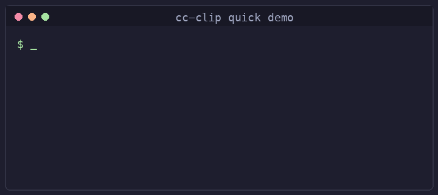
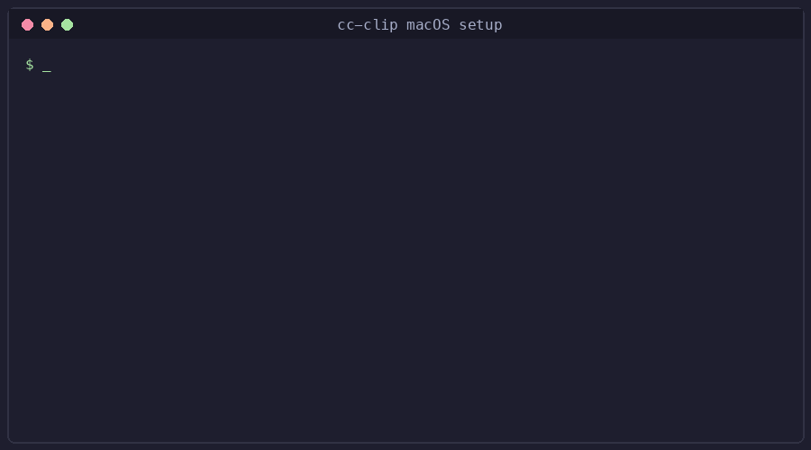
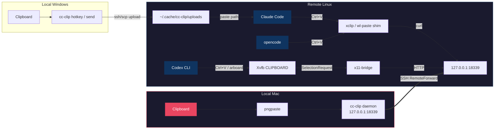

<p align="center">
  <b>English</b> ·
  <a href="README.zh-CN.md">简体中文</a> ·
  <a href="README.ja.md">日本語</a>
</p>

<p align="center">
  
</p>
<h1 align="center">cc-clip</h1>
<p align="center">
  <b>Paste images over SSH for Claude Code, Codex CLI, and opencode — plus desktop notifications for Claude Code and Codex CLI.</b>
</p>
<p align="center">
  <a href="https://github.com/ShunmeiCho/cc-clip/releases"></a>
  <a href="LICENSE"></a>
  <a href="https://go.dev"></a>
  <a href="https://github.com/ShunmeiCho/cc-clip/stargazers"></a>
</p>

<p align="center">
  
  <br>
  <em>Install → setup → paste. Clipboard works over SSH.</em>
</p>

---

<details>
<summary><b>Table of Contents</b></summary>

- [The Problem](#the-problem)
- [The Solution](#the-solution)
- [Prerequisites](#prerequisites)
- [Quick Start](#quick-start)
- [Why cc-clip?](#why-cc-clip)
- [How It Works](#how-it-works)
- [SSH Notifications](#ssh-notifications)
- [Security](#security)
- [Daily Usage](#daily-usage)
- [Commands](#commands)
- [Configuration](#configuration)
- [Platform Support](#platform-support)
- [Requirements](#requirements)
- [Troubleshooting](#troubleshooting)
- [Contributing](#contributing)
- [Related](#related)
- [License](#license)

</details>

---

## The Problem

When running Claude Code, Codex CLI, or opencode on a remote server via SSH, **image paste often doesn't work** and **notifications don't reach you**. The remote clipboard is empty — no screenshots, no diagrams. And when your coding agent finishes a task or needs approval, you have no idea unless you're staring at the terminal.

## The Solution

```text
Image paste:
  Claude Code (macOS):   Mac clipboard     → cc-clip daemon → SSH tunnel → xclip shim        → Claude Code
  Claude Code (Windows): Windows clipboard → cc-clip hotkey → SSH/SCP    → remote file path  → Claude Code
  Codex CLI:             Mac clipboard     → cc-clip daemon → SSH tunnel → x11-bridge/Xvfb   → Codex CLI
  opencode:              Mac clipboard     → cc-clip daemon → SSH tunnel → xclip/wl-paste shim → opencode

Notifications (Claude Code + Codex CLI):
  Claude Code hook → cc-clip-hook → SSH tunnel → local daemon → macOS/cmux notification
  Codex notify     → cc-clip notify             → SSH tunnel → local daemon → macOS/cmux notification
```

One tool. No changes to Claude Code, Codex, or opencode. Clipboard works for all three; notifications are wired for Claude Code and Codex CLI.

## Prerequisites

- **Local machine:** macOS 13+ or Windows 10/11
- **Remote server:** Linux (amd64 or arm64) accessible via SSH
- **SSH config:** You must have a Host entry in `~/.ssh/config` for your remote server

If you don't have an SSH config entry yet, add one:

```
# ~/.ssh/config
Host myserver
    HostName 10.0.0.1       # your server's IP or domain
    User your-username
    IdentityFile ~/.ssh/id_rsa  # optional, if using key auth
```

If you are on Windows and want the SSH/Claude Code workflow, use the dedicated guide:

- [Windows Quick Start](docs/windows-quickstart.md)

## Quick Start

### Step 1: Install cc-clip

macOS / Linux:

```bash
curl -fsSL https://raw.githubusercontent.com/ShunmeiCho/cc-clip/main/scripts/install.sh | sh
```

Windows:

Follow the dedicated guide:

- [Windows Quick Start](docs/windows-quickstart.md)

> **Windows support is experimental.** v0.6.0 ships the hotkey-conflict validation fix; clipboard persistence hardening is still being verified on real Windows hosts (tracked in [#30](https://github.com/ShunmeiCho/cc-clip/pull/30)).

On macOS / Linux, add `~/.local/bin` to your PATH if prompted:

```bash
# Add to your shell profile (~/.zshrc or ~/.bashrc)
export PATH="$HOME/.local/bin:$PATH"

# Reload your shell
source ~/.zshrc  # or: source ~/.bashrc
```

Verify the installation:

```bash
cc-clip --version
```

> **macOS "killed" error?** If you see `zsh: killed cc-clip`, macOS Gatekeeper is blocking the binary. Fix: `xattr -d com.apple.quarantine ~/.local/bin/cc-clip`

### Step 2: Setup (one command)

```bash
cc-clip setup myserver
```

This single command handles everything:
1. Installs local dependencies (`pngpaste`)
2. Configures SSH (`RemoteForward`, `ControlMaster no`)
3. Starts the local daemon (via macOS launchd)
4. Deploys the binary and shim to the remote server

<details>
<summary>See it in action (macOS)</summary>
<p align="center">
  
</p>
</details>

#### Which setup command do I run?

Pick the row that matches your remote workflow. These are the only decisions you need to make:

| Your remote CLI | Command | What it adds | Remote `sudo` needed? |
|---|---|---|---|
| Claude Code only | `cc-clip setup myserver` | xclip / wl-paste shim | ❌ No |
| Claude Code + Codex CLI | `cc-clip setup myserver --codex` | shim **plus** Xvfb + x11-bridge on the remote (see below) | ✅ **Yes** — passwordless `sudo` for `apt`/`dnf install xvfb`, or run it manually first |
| opencode only | `cc-clip setup myserver` | shim only — opencode reads the clipboard via the same xclip / wl-paste path as Claude Code, so it works without `--codex` | ❌ No |
| Windows local machine | See [Windows Quick Start](docs/windows-quickstart.md) | different workflow — do not use `--codex` | ❌ No |

> **Prerequisite for `--codex`** (the only row in the table above that needs `sudo`): Xvfb must be installed on the remote. `cc-clip setup --codex` will try `sudo apt install xvfb` (Debian/Ubuntu) or `sudo dnf install xorg-x11-server-Xvfb` (RHEL/Fedora) for you — but if passwordless `sudo` isn't available, it aborts and prints the exact command to run manually. Re-run `cc-clip setup myserver --codex` after you've installed Xvfb.
>
> If your remote permits neither passwordless `sudo` nor a one-off manual install, stick with `cc-clip setup myserver` (without `--codex`). Clipboard paste still works for Claude Code and opencode; only the Codex CLI path needs Xvfb.

> **Rule of thumb:** Use `--codex` **only** if you actually run Codex CLI on the remote. It is otherwise unnecessary overhead.

### Step 3 (Codex CLI only): what `--codex` adds

Codex CLI reads the clipboard via X11 directly (through the `arboard` crate) rather than shelling out to `xclip`, so the transparent shim cannot intercept it. `--codex` closes that gap by adding, on the remote:

1. **Xvfb** — a headless X server. **Requires `sudo`:** `cc-clip` tries `sudo apt install xvfb` or `sudo dnf install xorg-x11-server-Xvfb` automatically if you have passwordless `sudo`. If not, it aborts with the exact command to run manually, then you re-run `cc-clip setup myserver --codex`.
2. **`cc-clip x11-bridge`** — a background process that claims the Xvfb clipboard and serves image data on demand, fetched through the same SSH tunnel as the Claude Code path.
3. **`DISPLAY=127.0.0.1:N`** — an injection into your shell rc on the remote, so Codex's next process picks it up automatically. (TCP-loopback form, not the Unix-socket `:N` form, because Codex CLI's sandbox blocks `/tmp/.X11-unix/`.)

You do not need to understand any of this to use Codex paste — it's listed so you know what `--codex` touches on your server and how to diagnose it later.

<details>
<summary>Windows local? Use the dedicated guide</summary>

- [Windows Quick Start](docs/windows-quickstart.md)

<p align="center">
  
</p>

Note: the Windows workflow is orthogonal to `--codex`. The Windows local machine uploads images via SCP; there is no Xvfb path on the local side.

</details>

### Step 4: Connect and use

Open a **new** SSH session to your server (the tunnel activates on SSH connection):

```bash
ssh myserver
```

Then use Claude Code, Codex CLI, or opencode as normal — `Ctrl+V` (or whatever the agent binds to clipboard paste) now pastes images from your Mac clipboard.

> **Important:** The image paste works through the SSH tunnel. You must connect via `ssh myserver` (the host you set up). The tunnel is established on each SSH connection.

### Verify it works

Generic end-to-end check from your local machine (works for Claude Code, Codex, and opencode):

```bash
# Copy an image to your Mac clipboard first (Cmd+Shift+Ctrl+4), then:
cc-clip doctor --host myserver
```

#### Codex-specific verify

If you used `--codex`, these four commands on the remote server confirm the Codex-specific components are healthy. Copy an image on your Mac first, then SSH in:

```bash
ssh myserver

# 1. DISPLAY is injected
echo $DISPLAY                   # expected: 127.0.0.1:0 (or :1, :2, …)

# 2. Xvfb is running
ps aux | grep Xvfb | grep -v grep

# 3. x11-bridge is running
ps aux | grep 'cc-clip x11-bridge' | grep -v grep

# 4. Clipboard negotiation works end-to-end
xclip -selection clipboard -t TARGETS -o    # expected: image/png
```

If any step fails, the most common fix is `cc-clip connect myserver --codex --force` from your local machine — see the full recipe under [Troubleshooting](#troubleshooting) → "Ctrl+V doesn't paste images (Codex CLI)".

### `setup` vs `connect` — which to run when

You only need to know these three moves. Append `--codex` to the `setup` or `connect` commands below if you use Codex CLI on the remote; otherwise omit it.

| Situation | Command (Claude Code only) | Command (also running Codex CLI) |
|---|---|---|
| **First-time install** on this host | `cc-clip setup myserver` | `cc-clip setup myserver --codex` |
| **Broken state** (DISPLAY empty, x11-bridge missing, tunnel won't probe) | `cc-clip connect myserver --force` | `cc-clip connect myserver --codex --force` |
| **Daemon rotated token** and the remote still has the old one | `cc-clip connect myserver --token-only` | `cc-clip connect myserver --token-only` |

`setup` is the first-time path (deps + SSH config + daemon + deploy). `connect` is the repair/redeploy path — same deploy steps, but it assumes SSH config and the local daemon are already in place.

On Windows, the equivalent quick check is:

- [Windows Quick Start](docs/windows-quickstart.md)

## Why cc-clip?

| Approach | Works over SSH? | Any terminal? | Image support? | Setup complexity |
|----------|:-:|:-:|:-:|:--:|
| Native Ctrl+V | Local only | Some | Yes | None |
| X11 Forwarding | Yes (slow) | N/A | Yes | Complex |
| OSC 52 clipboard | Partial | Some | Text only | None |
| **cc-clip** | **Yes** | **Yes** | **Yes** | **One command** |

## How It Works



1. **macOS Claude path:** the local daemon reads your Mac clipboard via `pngpaste`, serves images over HTTP on loopback, and the remote `xclip` / `wl-paste` shim fetches images through the SSH tunnel
2. **opencode path:** same shim as the Claude Code path — opencode reads the clipboard through `xclip` (X11) or `wl-paste` (Wayland), so cc-clip's shim transparently serves the Mac clipboard without any opencode-specific configuration
3. **Windows Claude path:** the local hotkey reads your Windows clipboard, uploads the image over SSH/SCP, and pastes the remote file path into the active terminal
4. **Codex CLI path:** x11-bridge claims CLIPBOARD ownership on a headless Xvfb, serves images on-demand when Codex reads the clipboard via X11 (via the `arboard` crate, which cannot be shim-intercepted like `xclip`)
5. **Notification path:** remote Claude Code hooks and Codex notify pipe events through `cc-clip-hook` → SSH tunnel → local daemon → macOS Notification Center or cmux

## SSH Notifications

Remote hook events (Claude finishing, tool approval requests, image paste events, Codex task completion) travel through the same SSH tunnel as the clipboard and surface as native macOS / cmux notifications on your local machine. This solves the usual SSH notification failures — `TERM_PROGRAM` not forwarded, `terminal-notifier` absent on the remote, tmux swallowing OSC sequences.

| Event | Notification |
|-------|-------------|
| Claude finishes responding | "Claude stopped" + last message preview |
| Claude needs tool approval | "Tool approval needed" + tool name |
| Codex task completes | "Codex" + completion message |
| Image pasted via Ctrl+V | "cc-clip #N" + fingerprint + dimensions |

**Coverage by CLI:**

| CLI | Auto-configured by `cc-clip connect`? |
|-----|----------------------------------------|
| Codex CLI | ✅ If `~/.codex/` exists on the remote |
| Claude Code | ⚠️ Manual — add `cc-clip-hook` to `~/.claude/settings.json` |
| opencode | ❌ Not yet supported out of the box |

Full setup, manual configuration for Claude Code, nonce registration, and troubleshooting: **[docs/notifications.md](docs/notifications.md)**.

## Security

| Layer | Protection |
|-------|-----------|
| Network | Loopback only (`127.0.0.1`) — never exposed |
| Clipboard auth | Bearer token with 30-day sliding expiration (auto-renews on use) |
| Notification auth | Dedicated nonce per-connect session (separate from clipboard token) |
| Token delivery | Via stdin, never in command-line args |
| Notification trust | Hook notifications marked `verified`; generic JSON shows `[unverified]` prefix |
| Transparency | Non-image calls pass through to real `xclip` unchanged |

## Daily Usage

After initial setup, your daily workflow is:

```bash
# 1. SSH to your server (tunnel activates automatically)
ssh myserver

# 2. Use Claude Code or Codex CLI normally
claude          # Claude Code
codex           # Codex CLI

# 3. Ctrl+V pastes images from your Mac clipboard
```

The local daemon runs as a macOS launchd service and starts automatically on login. No need to re-run setup.

### Windows workflow

On Windows, some `Windows Terminal -> SSH -> tmux -> Claude Code` combinations do not trigger the remote `xclip` path when you press `Alt+V` or `Ctrl+V`. `cc-clip` therefore provides a Windows-native workflow that does not depend on remote clipboard interception.

For first-time setup and day-to-day usage, use:

- [Windows Quick Start](docs/windows-quickstart.md)

The Windows workflow uses a dedicated remote-paste hotkey (default: `Alt+Shift+V`) so it does not collide with local Claude Code's native `Alt+V`.

## Commands

The 10 you'll actually use:

| Command | Description |
|---------|-------------|
| `cc-clip setup <host>` | **Full setup**: deps, SSH config, daemon, deploy |
| `cc-clip setup <host> --codex` | Full setup with Codex CLI support |
| `cc-clip connect <host> --force` | Repair/redeploy (when DISPLAY, x11-bridge, or tunnel is stuck) |
| `cc-clip connect <host> --token-only` | Sync rotated token without redeploying binaries |
| `cc-clip doctor --host <host>` | End-to-end health check |
| `cc-clip status` | Show local component status |
| `cc-clip service install` / `service uninstall` | Manage macOS launchd daemon auto-start |
| `cc-clip notify --title T --body B` | Send a generic notification through the tunnel |
| `cc-clip send [<host>] --paste` | Windows: upload clipboard image and paste remote path |
| `cc-clip hotkey [<host>]` | Windows: register the remote upload/paste hotkey |

Full command reference, including all flags and environment variables: **[docs/commands.md](docs/commands.md)**. Or run `cc-clip --help` for the authoritative list from the installed binary.

## Configuration

All settings have sensible defaults. Override via environment variables. Full list in [docs/commands.md](docs/commands.md#environment-variables):

| Setting | Default | Env Var |
|---------|---------|---------|
| Port | 18339 | `CC_CLIP_PORT` |
| Token TTL | 30d | `CC_CLIP_TOKEN_TTL` |
| Debug logs | off | `CC_CLIP_DEBUG=1` |

## Platform Support

| Local | Remote | Status |
|-------|--------|--------|
| macOS (Apple Silicon) | Linux (amd64) | Stable |
| macOS (Intel) | Linux (arm64) | Stable |
| Windows 10/11 | Linux (amd64/arm64) | Experimental (`send` / `hotkey`) |

### Supported Remote CLIs

cc-clip works with **any coding agent that reads the clipboard via `xclip` or `wl-paste`** on Linux. No per-CLI configuration is needed — the transparent shim intercepts clipboard reads from any process that invokes these binaries.

| CLI | Image paste | Notifications |
|-----|-------------|----------------|
| [Claude Code](https://www.anthropic.com/claude-code) | ✅ out of the box (xclip / wl-paste shim) | ✅ via `cc-clip-hook` in `Stop` / `Notification` hooks |
| [Codex CLI](https://github.com/openai/codex) | ✅ out of the box (Xvfb + x11-bridge; needs `--codex`) | ✅ auto-configured during `cc-clip connect` if `~/.codex/` exists |
| [opencode](https://opencode.ai) | ✅ out of the box (xclip shim on X11, wl-paste shim on Wayland) | ⚠️ not auto-configured — wire your own notifier if desired |
| Any other `xclip`/`wl-paste` consumer | ✅ should just work — please [open a discussion](https://github.com/ShunmeiCho/cc-clip/discussions) if it doesn't | — |

`cc-clip setup HOST` installs the xclip and wl-paste shims regardless of which CLI you use; opencode picks them up automatically the next time it reads the clipboard.

## Requirements

**Local (macOS):** macOS 13+ (`pngpaste`, auto-installed by `cc-clip setup`)

**Local (Windows):** Windows 10/11 with PowerShell, `ssh`, and `scp` available in `PATH`

**Remote:** Linux with `xclip`, `curl`, `bash`, and SSH access. The macOS tunnel/shim path is auto-configured by `cc-clip connect`; the Windows upload/hotkey path uses SSH/SCP directly.

**Remote (Codex `--codex`):** Additionally requires `Xvfb`. Auto-installed if passwordless sudo is available, otherwise: `sudo apt install xvfb` (Debian/Ubuntu) or `sudo dnf install xorg-x11-server-Xvfb` (RHEL/Fedora).

## Troubleshooting

```bash
# One command to check everything
cc-clip doctor --host myserver
```

<details>
<summary><b>"zsh: killed" after installation</b></summary>

**Symptom:** Running any `cc-clip` command immediately shows `zsh: killed cc-clip ...`

**Cause:** macOS Gatekeeper blocks unsigned binaries downloaded from the internet.

**Fix:**

```bash
xattr -d com.apple.quarantine ~/.local/bin/cc-clip
```

Or reinstall (the latest install script handles this automatically):

```bash
curl -fsSL https://raw.githubusercontent.com/ShunmeiCho/cc-clip/main/scripts/install.sh | sh
```

</details>

<details>
<summary><b>"cc-clip: command not found"</b></summary>

**Cause:** `~/.local/bin` is not in your PATH.

**Fix:**

```bash
# Add to your shell profile
echo 'export PATH="$HOME/.local/bin:$PATH"' >> ~/.zshrc
source ~/.zshrc
```

Replace `~/.zshrc` with `~/.bashrc` if you use bash.

</details>

<details>
<summary><b>Ctrl+V doesn't paste images (Claude Code)</b></summary>

**Step-by-step verification:**

```bash
# 1. Local: Is the daemon running?
curl -s http://127.0.0.1:18339/health
# Expected: {"status":"ok"}

# 2. Remote: Is the tunnel forwarding?
ssh myserver "curl -s http://127.0.0.1:18339/health"
# Expected: {"status":"ok"}

# 3. Remote: Is the shim taking priority?
ssh myserver "which xclip"
# Expected: ~/.local/bin/xclip  (NOT /usr/bin/xclip)

# 4. Remote: Does the shim intercept correctly?
# (copy an image to Mac clipboard first)
ssh myserver 'CC_CLIP_DEBUG=1 xclip -selection clipboard -t TARGETS -o'
# Expected: image/png
```

If step 2 fails, you need to open a **new** SSH connection (the tunnel is established on connect).

If step 3 fails, the PATH fix didn't take effect. Log out and back in, or run: `source ~/.bashrc`

</details>

<details>
<summary><b>New SSH tab says "remote port forwarding failed for listen port 18339"</b></summary>

**Symptom:** A newly opened SSH tab warns `remote port forwarding failed for listen port 18339`, and image paste in that tab does nothing.

**Cause:** `cc-clip` uses a fixed remote port (`18339`) for the reverse tunnel. If another SSH session to the same host already owns that port, or a stale `sshd` child is still holding it, the new tab cannot establish its own tunnel.

**Fix:**

```bash
# Inspect the remote port without opening another forward:
ssh -o ClearAllForwardings=yes myserver "ss -tln | grep 18339 || true"
```

- If another live SSH tab already owns the tunnel, use that tab/session, or close it before opening a new one.
- If the port is stuck after a disconnect, follow the stale `sshd` cleanup steps below.
- If you truly need multiple concurrent SSH sessions with image paste, give each host alias a different `cc-clip` port instead of sharing `18339`.

</details>

<details>
<summary><b>Ctrl+V doesn't paste images (Codex CLI)</b></summary>

> **Most common cause:** DISPLAY environment variable is empty. You must open a **new** SSH session after setup — existing sessions don't pick up the updated shell rc file.

**Step-by-step verification (run these on the remote server):**

```bash
# 1. Is DISPLAY set?
echo $DISPLAY
# Expected: 127.0.0.1:0 (or 127.0.0.1:1, etc.)
# If empty → open a NEW SSH session, or run: source ~/.bashrc

# 2. Is the SSH tunnel working?
curl -s http://127.0.0.1:18339/health
# Expected: {"status":"ok"}
# If fails → open a NEW SSH connection (tunnel activates on connect)

# 3. Is Xvfb running?
ps aux | grep Xvfb | grep -v grep
# Expected: a Xvfb process
# If missing → re-run: cc-clip connect myserver --codex --force

# 4. Is x11-bridge running?
ps aux | grep 'cc-clip x11-bridge' | grep -v grep
# Expected: a cc-clip x11-bridge process
# If missing → re-run: cc-clip connect myserver --codex --force

# 5. Does the X11 socket exist?
ls -la /tmp/.X11-unix/
# Expected: X0 file (matching your display number)

# 6. Can xclip read clipboard via X11? (copy an image on Mac first)
xclip -selection clipboard -t TARGETS -o
# Expected: image/png
```

**Common fixes:**

| Step fails | Fix |
|-----------|-----|
| Step 1 (DISPLAY empty) | Open a **new** SSH session. If still empty: `source ~/.bashrc` |
| Step 2 (tunnel down) | Open a **new** SSH connection — tunnel is per-connection |
| Steps 3-4 (processes missing) | `cc-clip connect myserver --codex --force` from local |
| Step 6 (no image/png) | Copy an image on Mac first: `Cmd+Shift+Ctrl+4` |

> **Note:** DISPLAY uses TCP loopback format (`127.0.0.1:N`) instead of Unix socket format (`:N`) because Codex CLI's sandbox blocks access to `/tmp/.X11-unix/`. If you previously set up cc-clip with an older version, re-run `cc-clip connect myserver --codex --force` to update.

</details>

<details>
<summary><b>Setup fails: "killed" during re-deployment</b></summary>

**Symptom:** `cc-clip setup` was working before, but now shows `zsh: killed` when re-running.

**Cause:** The launchd service is running the old binary. Replacing the binary while the daemon holds it open can cause conflicts.

**Fix:**

```bash
cc-clip service uninstall
curl -fsSL https://raw.githubusercontent.com/ShunmeiCho/cc-clip/main/scripts/install.sh | sh
cc-clip setup myserver
```

</details>

<details>
<summary><b>More issues</b></summary>

See [Troubleshooting Guide](docs/troubleshooting.md) for detailed diagnostics, or run `cc-clip doctor --host myserver`.

</details>

## Contributing

Contributions welcome! For bug reports and feature requests, [open an issue](https://github.com/ShunmeiCho/cc-clip/issues).

For code contributions:

```bash
git clone https://github.com/ShunmeiCho/cc-clip.git
cd cc-clip
make build && make test
```

- **Bug fixes:** Open a PR directly with a clear description of the fix
- **New features:** Open an issue first to discuss the approach
- **Commit style:** [Conventional Commits](https://www.conventionalcommits.org/) (`feat:`, `fix:`, `docs:`, etc.)

## Related

**Claude Code — Clipboard:**
- [anthropics/claude-code#5277](https://github.com/anthropics/claude-code/issues/5277) — Image paste in SSH sessions
- [anthropics/claude-code#29204](https://github.com/anthropics/claude-code/issues/29204) — xclip/wl-paste dependency

**Claude Code — Notifications:**
- [anthropics/claude-code#19976](https://github.com/anthropics/claude-code/issues/19976) — Terminal notifications fail in tmux/SSH
- [anthropics/claude-code#29928](https://github.com/anthropics/claude-code/issues/29928) — Built-in completion notifications
- [anthropics/claude-code#36885](https://github.com/anthropics/claude-code/issues/36885) — Notification when waiting for input (headless/SSH)
- [anthropics/claude-code#29827](https://github.com/anthropics/claude-code/issues/29827) — Webhook/push notification for permission requests
- [anthropics/claude-code#36850](https://github.com/anthropics/claude-code/issues/36850) — Terminal bell on tool approval prompt
- [anthropics/claude-code#32610](https://github.com/anthropics/claude-code/issues/32610) — Terminal bell on completion
- [anthropics/claude-code#40165](https://github.com/anthropics/claude-code/issues/40165) — OSC-99 notification support assumed, not queried

**Codex CLI — Clipboard:**
- [openai/codex#6974](https://github.com/openai/codex/issues/6974) — Linux: cannot paste image
- [openai/codex#6080](https://github.com/openai/codex/issues/6080) — Image pasting issue
- [openai/codex#13716](https://github.com/openai/codex/issues/13716) — Clipboard image paste failure on Linux
- [openai/codex#7599](https://github.com/openai/codex/issues/7599) — Image clipboard does not work in WSL

**Codex CLI — Notifications:**
- [openai/codex#3962](https://github.com/openai/codex/issues/3962) — Play a sound when Codex finishes (34 comments)
- [openai/codex#8929](https://github.com/openai/codex/issues/8929) — Notify hook not getting triggered
- [openai/codex#8189](https://github.com/openai/codex/issues/8189) — WSL2: notifications fail for approval prompts

**opencode — Clipboard:**
- [anomalyco/opencode#19294](https://github.com/anomalyco/opencode/issues/19294) — Image paste works over SSH, but sending fails with "invalid image data"
- [anomalyco/opencode#16962](https://github.com/anomalyco/opencode/issues/16962) — Clipboard copy not working over SSH (Mac-to-Mac)
- [anomalyco/opencode#15907](https://github.com/anomalyco/opencode/issues/15907) — Clipboard copy not working over SSH + tmux in Ghostty
- [anomalyco/opencode#19502](https://github.com/anomalyco/opencode/issues/19502) — Windows Terminal + WSL: Ctrl+V image paste is inconsistent
- [anomalyco/opencode#17616](https://github.com/anomalyco/opencode/issues/17616) — Image paste from clipboard broken on Windows

**opencode — Notifications:**
- [anomalyco/opencode#18004](https://github.com/anomalyco/opencode/issues/18004) — Allow notifications even when opencode is focused

**Terminal / Multiplexer:**
- [manaflow-ai/cmux#833](https://github.com/manaflow-ai/cmux/issues/833) — Notifications over SSH+tmux sessions
- [manaflow-ai/cmux#559](https://github.com/manaflow-ai/cmux/issues/559) — Better SSH integration
- [ghostty-org/ghostty#10517](https://github.com/ghostty-org/ghostty/discussions/10517) — SSH image paste discussion

## License

[MIT](LICENSE)
