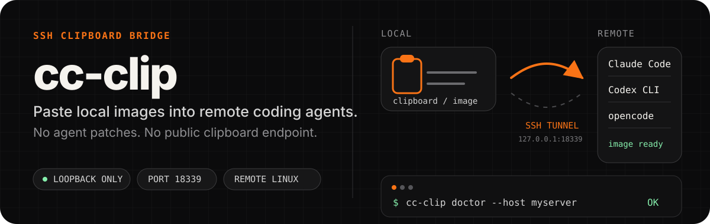
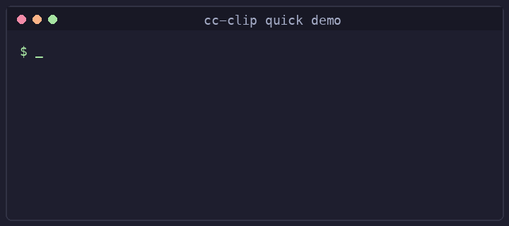

<p align="center">
  <b>English</b> ·
  <a href="README.zh-CN.md">简体中文</a> ·
  <a href="README.ja.md">日本語</a>
</p>

<p align="center">
  
</p>

<p align="center">
  <a href="https://github.com/ShunmeiCho/cc-clip/releases"></a>
  <a href="https://github.com/ShunmeiCho/cc-clip/actions/workflows/ci.yml"></a>
  <a href="LICENSE"></a>
</p>

<p align="center">
  <b>Paste images into remote Claude Code, Codex CLI, opencode, and Cursor sessions over SSH — and copy text back out, free of terminal soft-wrap.</b><br>
  Optional integrations bring completion and approval notifications back to your desktop.
</p>

<p align="center">
  <a href="#quick-start">Quick start</a> ·
  <a href="#choose-a-target">Choose a target</a> ·
  <a href="#how-it-works">How it works</a> ·
  <a href="#documentation">Documentation</a>
</p>

<p align="center">
  
  <br>
  <em>Install → setup → open SSH → paste.</em>
</p>

> **Upgrading from v0.8.x?** In v0.9.0, `--codex` became Codex-only. Use
> `--all` when the same host also needs the Claude integration. See the
> [upgrade guide](docs/upgrading.md#upgrading-from-v08x-to-v090).

## Quick Start

This is the stable macOS-to-Linux path. You need:

- macOS 13 or later;
- a Linux remote (amd64 or arm64) with `curl`, `bash`, and `xclip` or `wl-paste`;
- a named `Host` entry in `~/.ssh/config`.

### 1. Install

```bash
curl -fsSL https://raw.githubusercontent.com/ShunmeiCho/cc-clip/main/scripts/install.sh | sh
cc-clip --version
```

If the installer asks, add `~/.local/bin` to your `PATH` before continuing.

### 2. Set up one host

```bash
cc-clip setup myserver
```

The default target is Claude Code. Setup checks local dependencies, adds the
loopback `RemoteForward`, starts the local daemon, and deploys the remote shim.
Use a target flag from the next section for Codex, opencode, or notifications.

### 3. Open a new SSH session

```bash
ssh myserver
```

Start your coding agent and paste as usual. The new SSH connection is important:
it is what holds the reverse tunnel open.

### 4. Verify the whole path

Copy an image to the Mac clipboard, then run locally:

```bash
cc-clip doctor --host myserver
```

## Choose a Target

Choose one selector per setup. With no selector, cc-clip configures Claude Code.

| Remote workflow | Setup command | Image paste | Desktop notifications | Extra requirement |
|---|---|:---:|:---:|---|
| Claude Code | `cc-clip setup myserver` | Yes | Yes | `xclip` or `wl-paste` |
| Codex CLI only | `cc-clip setup myserver --codex` | Yes | Yes | Xvfb; setup may need remote `sudo` |
| All integrations | `cc-clip setup myserver --all` | Yes | Yes | Xvfb for Codex |
| opencode | `cc-clip setup myserver --opencode` | Yes | Yes | `xclip` or `wl-paste` |
| Antigravity | `cc-clip setup myserver --agy` | No | Yes | Notification integration only |
| Cursor CLI | `cc-clip setup myserver --cursor` | Yes | No | `DISPLAY` or `WAYLAND_DISPLAY` set in Cursor's shell |

For Codex targets, cc-clip tries to install Xvfb with `apt` or `dnf`. If
passwordless `sudo` is unavailable, it stops and prints the exact install command;
run that command manually, then repeat setup.

The Claude, opencode, and Cursor paths use the remote `xclip` or `wl-paste`
shim. Codex reads X11 directly, so its target adds Xvfb and `cc-clip x11-bridge`
instead.

Cursor has one extra prerequisite the deploy cannot satisfy: its clipboard
reader only runs when `DISPLAY` or `WAYLAND_DISPLAY` is set in the shell where
Cursor runs (check with `echo $DISPLAY`). Connect with `ssh -X myserver` or
export an existing display — cc-clip deliberately does not invent one, because
a `DISPLAY` with no X server behind it would break clipboard fallback for every
other tool in that shell. Cursor also stops waiting for clipboard helpers after
about 4 seconds, so for large images over a slow link add
`export CC_CLIP_FETCH_TIMEOUT_MS=3000` to your remote shell rc. Cursor
notifications are not wired up yet.

If a package manager already owns `cc-clip` on the remote, preserve that
ownership with `cc-clip setup myserver --use-remote-bin`. Setup resolves
`cc-clip` under your remote **login shell's** PATH (so `~/.nix-profile/bin`,
pipx and asdf installs are found), records its version and hash, and performs
the normal integration setup without uploading a replacement binary.

The mode is remembered in the host's deploy state: later `cc-clip connect`
runs — including the `connect <host> --force` line that `cc-clip update`
suggests — keep using the package-managed binary without needing the flag
again. Deploy with `--local-bin` to switch the host back to uploaded
binaries. The flag cannot be combined with `--local-bin` in the same run.

> opencode and Antigravity integration generation is covered by tests, but host
> event delivery has not yet been smoke-tested on a representative machine.
> Please [report what you find](https://github.com/ShunmeiCho/cc-clip/issues).

### Other local platforms

| Local machine | Remote | Support level | Recommended path |
|---|---|---|---|
| macOS 13+ | Linux | Stable | `cc-clip setup HOST` |
| Windows 10/11 | Linux | Experimental | [`send` / `hotkey` quick start](docs/windows-quickstart.md) |
| Linux | Linux | Manual daemon | Run `cc-clip serve`, then `cc-clip setup HOST` in another shell |

Windows support remains experimental. Start with the explicit upload-and-paste
workflow in the [Windows Quick Start](docs/windows-quickstart.md). An opt-in
direct RemoteForward transport also exists (since v0.9.1), but it is not the
default.

## How It Works

cc-clip keeps the transport narrow and local to your SSH connection:

```text
Image paste
  local clipboard
      → cc-clip daemon on 127.0.0.1:18339
      → SSH RemoteForward
      → remote xclip/wl-paste shim or Xvfb bridge
      → remote coding agent

Notifications
  remote hook / notify command / plugin
      → SSH tunnel
      → local cc-clip daemon
      → macOS Notification Center or cmux
```

1. The local daemon reads clipboard data only when the remote side asks for it.
2. SSH exposes that daemon on remote loopback; no public listener is created.
3. Claude Code and opencode reach it through a transparent clipboard shim.
4. Codex reaches it through an Xvfb clipboard owner because Codex reads X11
   directly instead of invoking `xclip`.
5. Unrecognized `xclip` / `wl-paste` calls fall through to the real remote tool.

## Notifications

Clipboard data and agent events share the SSH tunnel but use separate
authentication material. `cc-clip connect` can wire:

| Source | Integration | Example event |
|---|---|---|
| Claude Code | Managed hooks | Stop, approval request, image paste |
| Codex CLI | `notify` command | Task completion |
| opencode | Generated plugin | Session idle |
| Antigravity | Generated plugin | Agent stop |

For adapter details, manual configuration, nonce registration, and diagnostics,
see [SSH Notifications](docs/notifications.md).

## Security Model

| Boundary | Protection |
|---|---|
| Network | Daemon and forwarded port bind to loopback only |
| Clipboard | Bearer token with 30-day sliding expiration |
| Notifications | Separate per-connect nonce |
| Process list | Tokens and hook payloads are not placed in command-line arguments |
| Fallback | Unrelated clipboard calls pass through to the real remote binary |

Loopback is shared by users on the same remote host. The token file is mode
`0600`, but cc-clip does not defend against another process acting as your Unix
account or reading your files. Read the explicit [threat model](SECURITY.md)
before using cc-clip on a shared or untrusted host.

## Essential Commands

| Command | Use it for |
|---|---|
| `cc-clip setup HOST [target]` | First-time dependencies, SSH config, daemon, and deploy |
| `cc-clip setup HOST --use-remote-bin` | Configure a host whose remote binary is package-managed |
| `cc-clip connect HOST --force [target]` | Repair or fully redeploy a host |
| `cc-clip connect HOST --token-only` | Sync a rotated or expired token |
| `cc-clip doctor --host HOST` | End-to-end diagnosis |
| `some-command \| cc-clip copy` (on the remote) | Copy remote output to your local clipboard, bypassing terminal soft-wrap |
| Yank in neovim / tmux copy-mode on the remote | Lands on your local clipboard too — see [reverse copy](docs/reverse-copy.md) |
| `cc-clip status` | Local component status |
| `cc-clip hosts list` | Known-host registry |
| `cc-clip update --check` | Check the published release channel |
| `cc-clip update` | Install the latest published release |

Run `cc-clip --help` for the authoritative command list. The
[commands guide](docs/commands.md) covers the common flags and environment
variables.

### Configuration

| Setting | Default | Environment variable |
|---|---:|---|
| Tunnel port | `18339` | `CC_CLIP_PORT` |
| Token lifetime | `30d` | `CC_CLIP_TOKEN_TTL` |
| Debug logging | off | `CC_CLIP_DEBUG=1` |

## Troubleshooting

Start with the built-in diagnosis:

```bash
cc-clip doctor --host myserver
```

The three most common fixes are:

- **Tunnel unavailable:** keep a fresh `ssh myserver` session open. A
  `RemoteForward` exists only while an SSH connection owns it.
- **Token rejected after daemon restart:** run
  `cc-clip connect myserver --token-only`.
- **Codex has no clipboard:** open a new SSH session so the injected `DISPLAY`
  is loaded; if Xvfb or x11-bridge is missing, run
  `cc-clip connect myserver --codex --force` (or `--all --force`).

If a new SSH tab reports `remote port forwarding failed for listen port 18339`,
another live or stale SSH session already owns the fixed remote port. Use the
working session, close the old one, or follow the port cleanup steps in the
[Troubleshooting Guide](docs/troubleshooting.md).

## When Not to Use cc-clip

Use a simpler option when it fits:

- use an editor's built-in remote clipboard if your whole workflow is already
  inside that editor;
- use OSC 52 for text-only clipboard synchronization;
- use `scp` when image transfer is rare and preserving paste behavior is not
  worth a daemon and SSH forward;
- use a general clipboard bridge when you need broad, bidirectional clipboard
  synchronization rather than a narrow agent workflow;
- avoid cc-clip on an untrusted shared host where remote local users must not
  reach your user-scoped loopback tunnel.

## Documentation

| Guide | What it covers |
|---|---|
| [Windows Quick Start](docs/windows-quickstart.md) | Windows upload, paste, and hotkey workflow |
| [Upgrading](docs/upgrading.md) | Breaking changes and version-specific migration |
| [Commands](docs/commands.md) | Common commands, flags, and environment variables |
| [Notifications](docs/notifications.md) | Hook and plugin integrations |
| [Troubleshooting](docs/troubleshooting.md) | Symptom-by-symptom diagnosis |
| [Security](SECURITY.md) | Threat model and trust boundaries |

## Contributing

Bug reports and focused pull requests are welcome. For larger features, open an
[issue](https://github.com/ShunmeiCho/cc-clip/issues) first so the approach can
be discussed.

Building from source requires the Go version declared in `go.mod`:

```bash
git clone https://github.com/ShunmeiCho/cc-clip.git
cd cc-clip
make build
make test
```

Use [Conventional Commits](https://www.conventionalcommits.org/) for commit
messages (`feat:`, `fix:`, `docs:`, and so on).

## License

[MIT](LICENSE)
