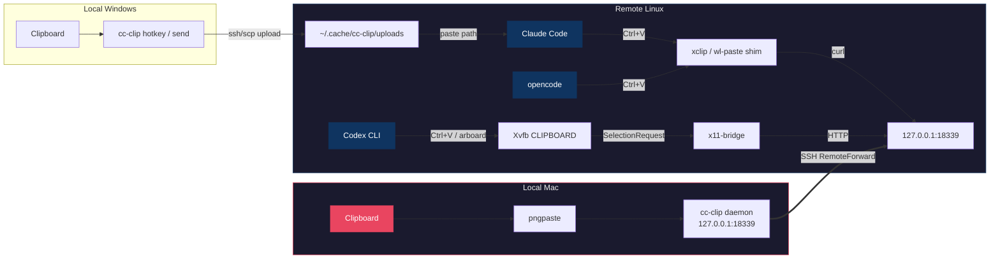

<!-- i18n-source: README.md @ d15a990fdccf3c2686a9dc69c26635f525ce65a1 -->

<p align="center">
  <a href="README.md">English</a> ·
  <b>简体中文</b> ·
  <a href="README.ja.md">日本語</a>
</p>

<p align="center">
  
</p>
<h1 align="center">cc-clip</h1>
<p align="center">
  <b>为 Claude Code、Codex CLI 和 opencode 通过 SSH 粘贴图片，并为 Claude Code 和 Codex CLI 提供桌面通知。</b>
</p>
<p align="center">
  <a href="https://github.com/ShunmeiCho/cc-clip/releases"></a>
  <a href="LICENSE"></a>
  <a href="https://go.dev"></a>
  <a href="https://github.com/ShunmeiCho/cc-clip/stargazers"></a>
</p>

<p align="center">
  
  <br>
  <em>安装 → 初始化 → 粘贴。剪贴板可跨 SSH 工作。</em>
</p>

> 这是英文 README 的简体中文翻译。如果翻译版与 [English README](README.md) 存在差异，以英文原版为准。翻译版本可能晚于英文主线更新。
>
> *This is the Simplified Chinese translation of the English README. If any content differs, the [English README](README.md) is authoritative. This translation may lag behind the English main line.*

---

<details>
<summary><b>目录</b></summary>

- [问题](#问题)
- [解决方案](#解决方案)
- [前置条件](#前置条件)
- [快速开始](#快速开始)
- [为什么选择 cc-clip？](#为什么选择-cc-clip)
- [工作原理](#工作原理)
- [SSH 通知](#ssh-通知)
- [安全性](#安全性)
- [日常使用](#日常使用)
- [命令](#命令)
- [配置](#配置)
- [平台支持](#平台支持)
- [要求](#要求)
- [故障排查](#故障排查)
- [贡献](#贡献)
- [相关问题](#相关问题)
- [许可证](#许可证)

</details>

---

## 问题

通过 SSH 在远程服务器上运行 Claude Code、Codex CLI 或 opencode 时，**图片粘贴经常无法工作**，**通知也到不了本地**。远程剪贴板是空的，截图和图表都传不过去。当 coding agent 完成任务或需要授权时，如果你没有盯着终端，就很难知道发生了什么。

## 解决方案

```text
图片粘贴:
  Claude Code (macOS):   Mac clipboard     → cc-clip daemon → SSH tunnel → xclip shim        → Claude Code
  Claude Code (Windows): Windows clipboard → cc-clip hotkey → SSH/SCP    → remote file path  → Claude Code
  Codex CLI:             Mac clipboard     → cc-clip daemon → SSH tunnel → x11-bridge/Xvfb   → Codex CLI
  opencode:              Mac clipboard     → cc-clip daemon → SSH tunnel → xclip/wl-paste shim → opencode

通知 (Claude Code + Codex CLI):
  Claude Code hook → cc-clip-hook → SSH tunnel → local daemon → macOS/cmux notification
  Codex notify     → cc-clip notify             → SSH tunnel → local daemon → macOS/cmux notification
```

一个工具即可。无需修改 Claude Code、Codex 或 opencode。三者都能使用剪贴板；通知已为 Claude Code 和 Codex CLI 接好。

## 前置条件

- **本地机器：** macOS 13+ 或 Windows 10/11
- **远程服务器：** 可通过 SSH 访问的 Linux（amd64 或 arm64）
- **SSH 配置：** 远程服务器必须在 `~/.ssh/config` 中有一个 Host 条目

如果还没有 SSH config 条目，添加一个：

```
# ~/.ssh/config
Host myserver
    HostName 10.0.0.1       # 你的服务器 IP 或域名
    User your-username
    IdentityFile ~/.ssh/id_rsa  # 可选，如果使用密钥认证
```

如果你在 Windows 上使用 SSH/Claude Code 工作流，请阅读专门的指南：

- [Windows Quick Start](docs/windows-quickstart.md)

## 快速开始

### 第 1 步：安装 cc-clip

macOS / Linux:

```bash
curl -fsSL https://raw.githubusercontent.com/ShunmeiCho/cc-clip/main/scripts/install.sh | sh
```

Windows:

请阅读专门的指南：

- [Windows Quick Start](docs/windows-quickstart.md)

> **Windows 支持仍处于实验阶段。** v0.6.0 已发布 hotkey 冲突校验修复；剪贴板持久化加固仍在真实 Windows 主机上验证中（由 [#30](https://github.com/ShunmeiCho/cc-clip/pull/30) 跟踪）。

在 macOS / Linux 上，如果安装脚本提示，请把 `~/.local/bin` 加到 PATH：

```bash
# 添加到你的 shell profile（~/.zshrc 或 ~/.bashrc）
export PATH="$HOME/.local/bin:$PATH"

# 重新加载 shell
source ~/.zshrc  # 或: source ~/.bashrc
```

验证安装：

```bash
cc-clip --version
```

> **macOS 出现 “killed” 错误？** 如果看到 `zsh: killed cc-clip`，说明 macOS Gatekeeper 阻止了这个二进制。修复：`xattr -d com.apple.quarantine ~/.local/bin/cc-clip`

### 第 2 步：初始化（一个命令）

```bash
cc-clip setup myserver
```

这个命令会处理所有事情：
1. 安装本地依赖（`pngpaste`）
2. 配置 SSH（`RemoteForward`、`ControlMaster no`）
3. 启动本地 daemon（通过 macOS launchd）
4. 把二进制和 shim 部署到远程服务器

<details>
<summary>查看效果（macOS）</summary>
<p align="center">
  
</p>
</details>

#### 我该运行哪个 setup 命令？

选择与你的远程工作流匹配的一行。你只需要做这些决策：

| 远程 CLI | 命令 | 会增加什么 | 远程需要 `sudo` 吗？ |
|---|---|---|---|
| 只用 Claude Code | `cc-clip setup myserver` | xclip / wl-paste shim | ❌ 不需要 |
| Claude Code + Codex CLI | `cc-clip setup myserver --codex` | shim **加上**远程的 Xvfb + x11-bridge（见下文） | ✅ **需要** — 用于 `apt`/`dnf install xvfb` 的 passwordless `sudo`，或先手动安装 |
| 只用 opencode | `cc-clip setup myserver` | 仅 shim — opencode 通过和 Claude Code 相同的 xclip / wl-paste 路径读取剪贴板，因此不需要 `--codex` |
| Windows 本地机器 | 见 [Windows Quick Start](docs/windows-quickstart.md) | 不同的工作流 — 不要使用 `--codex` | ❌ 不需要 |

> **`--codex` 的前置条件**（上表唯一需要 `sudo` 的行）：远程必须已安装 Xvfb。`cc-clip setup --codex` 会尝试为你运行 `sudo apt install xvfb`（Debian/Ubuntu）或 `sudo dnf install xorg-x11-server-Xvfb`（RHEL/Fedora）。但如果没有 passwordless `sudo`，它会中止并打印需要手动运行的准确命令。安装 Xvfb 后，再重新运行 `cc-clip setup myserver --codex`。
>
> 如果远程既不允许 passwordless `sudo`，也不能进行一次性手动安装，请使用 `cc-clip setup myserver`（不要加 `--codex`）。Claude Code 和 opencode 的剪贴板粘贴仍然可用；只有 Codex CLI 路径需要 Xvfb。

> **经验规则：** 只有当你真的在远程运行 Codex CLI 时，才使用 `--codex`。否则它只是额外开销。

### 第 3 步（仅 Codex CLI）：`--codex` 会增加什么

Codex CLI 会通过 X11 直接读取剪贴板（通过 `arboard` crate），而不是调用 `xclip`，所以透明 shim 无法拦截它。`--codex` 会在远程增加这些组件来补上这个缺口：

1. **Xvfb** — 一个 headless X server。**需要 `sudo`：** 如果你有 passwordless `sudo`，`cc-clip` 会自动尝试 `sudo apt install xvfb` 或 `sudo dnf install xorg-x11-server-Xvfb`。如果没有，它会中止并打印需要手动运行的准确命令；运行后再重新执行 `cc-clip setup myserver --codex`。
2. **`cc-clip x11-bridge`** — 一个后台进程，负责占用 Xvfb 的剪贴板，并在 Codex 需要时提供图片数据；数据通过和 Claude Code 路径相同的 SSH tunnel 获取。
3. **`DISPLAY=127.0.0.1:N`** — 注入到远程 shell rc 中，让 Codex 的下一个进程自动获得它。（使用 TCP loopback 形式，而不是 Unix socket 的 `:N` 形式，因为 Codex CLI sandbox 会阻止访问 `/tmp/.X11-unix/`。）

不需要理解这些细节也能使用 Codex 粘贴。这里列出来，是为了让你知道 `--codex` 会在服务器上触碰什么，以及之后如何诊断。

<details>
<summary>Windows 本地？使用专门指南</summary>

- [Windows Quick Start](docs/windows-quickstart.md)

<p align="center">
  
</p>

注意：Windows 工作流与 `--codex` 无关。Windows 本地机器通过 SCP 上传图片；本地侧没有 Xvfb 路径。

</details>

### 第 4 步：连接并使用

打开一个**新的** SSH 会话连接到服务器（tunnel 会在 SSH 连接建立时激活）：

```bash
ssh myserver
```

然后像平时一样使用 Claude Code、Codex CLI 或 opencode。`Ctrl+V`（或 agent 绑定的剪贴板粘贴键）现在会从你的 Mac 剪贴板粘贴图片。

> **重要：** 图片粘贴依赖 SSH tunnel。你必须通过 `ssh myserver`（你设置的那个 host）连接。每个 SSH 连接都会建立自己的 tunnel。

### 验证是否可用

从本地机器运行通用端到端检查（适用于 Claude Code、Codex 和 opencode）：

```bash
# 先把一张图片复制到 Mac 剪贴板（Cmd+Shift+Ctrl+4），然后运行：
cc-clip doctor --host myserver
```

#### Codex 专用验证

如果你使用了 `--codex`，在远程服务器上运行下面四个命令，确认 Codex 专属组件健康。先在 Mac 上复制一张图片，然后 SSH 进去：

```bash
ssh myserver

# 1. DISPLAY 已注入
echo $DISPLAY                   # 预期: 127.0.0.1:0（或 :1, :2, …）

# 2. Xvfb 正在运行
ps aux | grep Xvfb | grep -v grep

# 3. x11-bridge 正在运行
ps aux | grep 'cc-clip x11-bridge' | grep -v grep

# 4. 剪贴板协商端到端可用
xclip -selection clipboard -t TARGETS -o    # 预期: image/png
```

如果任一步失败，最常见的修复是在本地机器运行 `cc-clip connect myserver --codex --force`。完整步骤见 [故障排查](#故障排查) → “Ctrl+V 无法粘贴图片（Codex CLI）”。

### `setup` 和 `connect`：什么时候用哪个

只需要记住这三种情况。若你在远程使用 Codex CLI，就把 `--codex` 加到下面的 `setup` 或 `connect` 命令；否则省略。

| 场景 | 命令（只用 Claude Code） | 命令（也运行 Codex CLI） |
|---|---|---|
| **首次在这个 host 上安装** | `cc-clip setup myserver` | `cc-clip setup myserver --codex` |
| **状态损坏**（DISPLAY 为空、x11-bridge 缺失、tunnel 探测失败） | `cc-clip connect myserver --force` | `cc-clip connect myserver --codex --force` |
| **Daemon 轮换了 token，而远程仍是旧 token** | `cc-clip connect myserver --token-only` | `cc-clip connect myserver --token-only` |

`setup` 是首次使用路径（依赖 + SSH config + daemon + deploy）。`connect` 是修复/重新部署路径，部署步骤相同，但假设 SSH config 和本地 daemon 已经存在。

Windows 上的等价快速检查见：

- [Windows Quick Start](docs/windows-quickstart.md)

## 为什么选择 cc-clip？

| 方案 | 可跨 SSH？ | 任意终端？ | 支持图片？ | 设置复杂度 |
|----------|:-:|:-:|:-:|:--:|
| 原生 Ctrl+V | 仅本地 | 部分 | 是 | 无 |
| X11 Forwarding | 是（慢） | N/A | 是 | 复杂 |
| OSC 52 clipboard | 部分 | 部分 | 仅文本 | 无 |
| **cc-clip** | **是** | **是** | **是** | **一个命令** |

## 工作原理



1. **macOS Claude path：** 本地 daemon 通过 `pngpaste` 读取 Mac 剪贴板，在 loopback 上通过 HTTP 提供图片，远程 `xclip` / `wl-paste` shim 通过 SSH tunnel 拉取图片。
2. **opencode path：** 与 Claude Code path 使用同一个 shim。opencode 通过 `xclip`（X11）或 `wl-paste`（Wayland）读取剪贴板，因此 cc-clip 的 shim 会透明地提供 Mac 剪贴板内容，不需要 opencode 专属配置。
3. **Windows Claude path：** 本地 hotkey 读取 Windows 剪贴板，通过 SSH/SCP 上传图片，并把远程文件路径粘贴到当前终端。
4. **Codex CLI path：** x11-bridge 在 headless Xvfb 上占用 CLIPBOARD，当 Codex 通过 X11 读取剪贴板时按需提供图片（通过 `arboard` crate；它不像 `xclip` 那样能被 shim 拦截）。
5. **Notification path：** 远程 Claude Code hooks 和 Codex notify 事件通过 `cc-clip-hook` → SSH tunnel → 本地 daemon → macOS Notification Center 或 cmux。

## SSH 通知

远程 hook 事件（Claude 完成、工具授权请求、图片粘贴事件、Codex 任务完成）会通过和剪贴板相同的 SSH tunnel，到达本地机器并显示为 macOS / cmux 原生通知。这解决了常见的 SSH 通知失败：`TERM_PROGRAM` 不会转发、远程没有 `terminal-notifier`、tmux 会吞掉 OSC 序列。

| 事件 | 通知 |
|-------|-------------|
| Claude 完成回复 | “Claude stopped” + 最后一条消息预览 |
| Claude 需要工具授权 | “Tool approval needed” + 工具名 |
| Codex 任务完成 | “Codex” + 完成消息 |
| 通过 Ctrl+V 粘贴图片 | “cc-clip #N” + 指纹 + 尺寸 |

**按 CLI 覆盖范围：**

| CLI | 是否由 `cc-clip connect` 自动配置？ |
|-----|----------------------------------------|
| Codex CLI | ✅ 如果远程存在 `~/.codex/` |
| Claude Code | ⚠️ 手动 — 把 `cc-clip-hook` 加到 `~/.claude/settings.json` |
| opencode | ❌ 尚未开箱支持 |

完整设置、Claude Code 手动配置、nonce 注册和故障排查见：**[docs/notifications.md](docs/notifications.md)**。

## 安全性

| 层 | 保护 |
|-------|-----------|
| 网络 | 仅 loopback（`127.0.0.1`），不会暴露到外部 |
| 剪贴板认证 | Bearer token，30 天滑动过期（使用时自动续期） |
| 通知认证 | 每次 connect 独立 nonce（与剪贴板 token 分离） |
| Token 传递 | 通过 stdin，绝不出现在命令行参数中 |
| 通知信任 | Hook 通知标记为 `verified`；通用 JSON 显示 `[unverified]` 前缀 |
| 透明性 | 非图片调用会原样传给真实 `xclip` |

## 日常使用

初始化后，你的日常工作流是：

```bash
# 1. SSH 到服务器（tunnel 自动激活）
ssh myserver

# 2. 像平时一样使用 Claude Code 或 Codex CLI
claude          # Claude Code
codex           # Codex CLI

# 3. Ctrl+V 从 Mac 剪贴板粘贴图片
```

本地 daemon 会作为 macOS launchd 服务运行，并在登录时自动启动。无需重复运行 setup。

### Windows 工作流

在 Windows 上，某些 `Windows Terminal -> SSH -> tmux -> Claude Code` 组合在按 `Alt+V` 或 `Ctrl+V` 时不会触发远程 `xclip` 路径。因此，`cc-clip` 提供了一个 Windows 原生工作流，不依赖远程剪贴板拦截。

首次设置和日常使用请阅读：

- [Windows Quick Start](docs/windows-quickstart.md)

Windows 工作流使用专门的远程粘贴 hotkey（默认：`Alt+Shift+V`），因此不会和本地 Claude Code 原生的 `Alt+V` 冲突。

## 命令

实际最常用的 10 个：

| 命令 | 说明 |
|---------|-------------|
| `cc-clip setup <host>` | **完整初始化**：依赖、SSH config、daemon、deploy |
| `cc-clip setup <host> --codex` | 包含 Codex CLI 支持的完整初始化 |
| `cc-clip connect <host> --force` | 修复/重新部署（DISPLAY、x11-bridge 或 tunnel 卡住时） |
| `cc-clip connect <host> --token-only` | 只同步轮换后的 token，不重新部署二进制 |
| `cc-clip doctor --host <host>` | 端到端健康检查 |
| `cc-clip status` | 显示本地组件状态 |
| `cc-clip service install` / `service uninstall` | 管理 macOS launchd daemon 自动启动 |
| `cc-clip notify --title T --body B` | 通过 tunnel 发送通用通知 |
| `cc-clip send [<host>] --paste` | Windows：上传剪贴板图片并粘贴远程路径 |
| `cc-clip hotkey [<host>]` | Windows：注册远程上传/粘贴 hotkey |

完整命令参考（包括所有 flag 和环境变量）：**[docs/commands.md](docs/commands.md)**。或运行 `cc-clip --help` 查看已安装版本的权威列表。

## 配置

所有设置都有合理默认值。可通过环境变量覆盖。完整列表见 [docs/commands.md](docs/commands.md#environment-variables)：

| 设置 | 默认值 | 环境变量 |
|---------|---------|---------|
| Port | 18339 | `CC_CLIP_PORT` |
| Token TTL | 30d | `CC_CLIP_TOKEN_TTL` |
| Debug logs | off | `CC_CLIP_DEBUG=1` |

## 平台支持

| 本地 | 远程 | 状态 |
|-------|--------|--------|
| macOS (Apple Silicon) | Linux (amd64) | Stable |
| macOS (Intel) | Linux (arm64) | Stable |
| Windows 10/11 | Linux (amd64/arm64) | Experimental (`send` / `hotkey`) |

### 支持的远程 CLI

cc-clip 支持**任何在 Linux 上通过 `xclip` 或 `wl-paste` 读取剪贴板的 coding agent**。无需按 CLI 做配置，透明 shim 会拦截任何调用这些二进制的进程的剪贴板读取。

| CLI | 图片粘贴 | 通知 |
|-----|-------------|----------------|
| [Claude Code](https://www.anthropic.com/claude-code) | ✅ 开箱可用（xclip / wl-paste shim） | ✅ 通过 `Stop` / `Notification` hooks 中的 `cc-clip-hook` |
| [Codex CLI](https://github.com/openai/codex) | ✅ 开箱可用（Xvfb + x11-bridge；需要 `--codex`） | ✅ 如果远程存在 `~/.codex/`，会在 `cc-clip connect` 时自动配置 |
| [opencode](https://opencode.ai) | ✅ 开箱可用（X11 上 xclip shim，Wayland 上 wl-paste shim） | ⚠️ 不会自动配置 — 如有需要可自行接入 notifier |
| 任何其他 `xclip`/`wl-paste` consumer | ✅ 应该可以直接工作；如果不行，请[开启 discussion](https://github.com/ShunmeiCho/cc-clip/discussions) | — |

`cc-clip setup HOST` 会安装 xclip 和 wl-paste shim，不管你使用哪个 CLI；opencode 下一次读取剪贴板时会自动用上它们。

## 要求

**本地（macOS）：** macOS 13+（`pngpaste` 会由 `cc-clip setup` 自动安装）

**本地（Windows）：** Windows 10/11，PowerShell、`ssh` 和 `scp` 在 `PATH` 中可用

**远程：** Linux，具备 `xclip`、`curl`、`bash` 和 SSH 访问。本地 macOS tunnel/shim 路径由 `cc-clip connect` 自动配置；Windows 上传/hotkey 路径直接使用 SSH/SCP。

**远程（Codex `--codex`）：** 额外需要 `Xvfb`。如果有 passwordless sudo 会自动安装；否则运行：`sudo apt install xvfb`（Debian/Ubuntu）或 `sudo dnf install xorg-x11-server-Xvfb`（RHEL/Fedora）。

## 故障排查

```bash
# 一个命令检查所有内容
cc-clip doctor --host myserver
```

<details>
<summary><b>安装后出现 “zsh: killed”</b></summary>

**症状：** 运行任何 `cc-clip` 命令都会立刻显示 `zsh: killed cc-clip ...`

**原因：** macOS Gatekeeper 阻止了从互联网下载的未签名二进制。

**修复：**

```bash
xattr -d com.apple.quarantine ~/.local/bin/cc-clip
```

或者重新安装（最新版安装脚本会自动处理这个问题）：

```bash
curl -fsSL https://raw.githubusercontent.com/ShunmeiCho/cc-clip/main/scripts/install.sh | sh
```

</details>

<details>
<summary><b>`cc-clip` 不在 PATH 中</b></summary>

**症状：** 运行 `cc-clip` 时显示 `command not found`。

**修复：**

```bash
# 添加到你的 shell profile
echo 'export PATH="$HOME/.local/bin:$PATH"' >> ~/.zshrc
source ~/.zshrc
```

如果使用 bash，把 `~/.zshrc` 换成 `~/.bashrc`。

</details>

<details>
<summary><b>Ctrl+V 无法粘贴图片（Claude Code）</b></summary>

**逐步验证：**

```bash
# 1. Local: daemon 是否在运行？
curl -s http://127.0.0.1:18339/health
# 预期: {"status":"ok"}

# 2. Remote: tunnel 是否在转发？
ssh myserver "curl -s http://127.0.0.1:18339/health"
# 预期: {"status":"ok"}

# 3. Remote: shim 是否优先？
ssh myserver "which xclip"
# 预期: ~/.local/bin/xclip  (不是 /usr/bin/xclip)

# 4. Remote: shim 是否正确拦截？
# （先把图片复制到 Mac 剪贴板）
ssh myserver 'CC_CLIP_DEBUG=1 xclip -selection clipboard -t TARGETS -o'
# 预期: image/png
```

如果第 2 步失败，需要打开一个**新的** SSH 连接（tunnel 会在连接建立时创建）。

如果第 3 步失败，说明 PATH 修复没有生效。退出后重新登录，或运行：`source ~/.bashrc`

</details>

<details>
<summary><b>新 SSH 标签页提示 “remote port forwarding failed for listen port 18339”</b></summary>

**症状：** 新开的 SSH 标签页警告 `remote port forwarding failed for listen port 18339`，这个标签页里的图片粘贴没有反应。

**原因：** `cc-clip` 为反向 tunnel 使用固定远程端口（`18339`）。如果同一 host 的另一个 SSH 会话已经占用了该端口，或远程有 stale `sshd` 子进程仍在持有它，新标签页就无法建立自己的 tunnel。

**修复：**

```bash
# 不打开额外 forward，检查远程端口：
ssh -o ClearAllForwardings=yes myserver "ss -tln | grep 18339 || true"
```

- 如果另一个活跃 SSH 标签页已经拥有 tunnel，就使用那个标签页/会话，或先关闭它再打开新的。
- 如果断开后端口仍卡住，请按 stale `sshd` cleanup 步骤处理。
- 如果确实需要多个并发 SSH 会话都支持图片粘贴，请为每个 host alias 配置不同的 `cc-clip` 端口，而不是共用 `18339`。

</details>

<details>
<summary><b>Ctrl+V 无法粘贴图片（Codex CLI）</b></summary>

> **最常见原因：** DISPLAY 环境变量为空。setup 后必须打开一个**新的** SSH 会话；已有会话不会自动拿到更新后的 shell rc。

**逐步验证（在远程服务器上运行）：**

```bash
# 1. DISPLAY 是否已设置？
echo $DISPLAY
# 预期: 127.0.0.1:0（或 127.0.0.1:1 等）
# 如果为空 → 打开一个新的 SSH 会话，或运行: source ~/.bashrc

# 2. SSH tunnel 是否正常？
curl -s http://127.0.0.1:18339/health
# 预期: {"status":"ok"}
# 如果失败 → 打开新的 SSH 连接（tunnel 会在连接时激活）

# 3. Xvfb 是否在运行？
ps aux | grep Xvfb | grep -v grep
# 预期: 一个 Xvfb 进程
# 如果缺失 → 重新运行: cc-clip connect myserver --codex --force

# 4. x11-bridge 是否在运行？
ps aux | grep 'cc-clip x11-bridge' | grep -v grep
# 预期: 一个 cc-clip x11-bridge 进程
# 如果缺失 → 重新运行: cc-clip connect myserver --codex --force

# 5. X11 socket 是否存在？
ls -la /tmp/.X11-unix/
# 预期: X0 文件（与你的 display number 对应）

# 6. xclip 是否能通过 X11 读取剪贴板？（先在 Mac 上复制一张图片）
xclip -selection clipboard -t TARGETS -o
# 预期: image/png
```

**常见修复：**

| 失败步骤 | 修复 |
|-----------|-----|
| 第 1 步（DISPLAY 为空） | 打开一个**新的** SSH 会话。如果仍为空：`source ~/.bashrc` |
| 第 2 步（tunnel down） | 打开一个**新的** SSH 连接 — tunnel 是每个连接独立的 |
| 第 3-4 步（进程缺失） | 在本地运行 `cc-clip connect myserver --codex --force` |
| 第 6 步（没有 image/png） | 先在 Mac 上复制图片：`Cmd+Shift+Ctrl+4` |

> **注意：** DISPLAY 使用 TCP loopback 格式（`127.0.0.1:N`），而不是 Unix socket 格式（`:N`），因为 Codex CLI 的 sandbox 会阻止访问 `/tmp/.X11-unix/`。如果你曾用旧版本设置过 cc-clip，请重新运行 `cc-clip connect myserver --codex --force` 更新配置。

</details>

<details>
<summary><b>Setup 重新部署时失败并显示 “killed”</b></summary>

**症状：** `cc-clip setup` 以前能工作，但重新运行时显示 `zsh: killed`。

**原因：** launchd service 正在运行旧二进制。daemon 持有旧文件时替换二进制可能导致冲突。

**修复：**

```bash
cc-clip service uninstall
curl -fsSL https://raw.githubusercontent.com/ShunmeiCho/cc-clip/main/scripts/install.sh | sh
cc-clip setup myserver
```

</details>

<details>
<summary><b>更多问题</b></summary>

查看 [Troubleshooting Guide](docs/troubleshooting.md) 获取详细诊断，或运行 `cc-clip doctor --host myserver`。

</details>

## 贡献

欢迎贡献。Bug 报告和功能请求请[开启 issue](https://github.com/ShunmeiCho/cc-clip/issues)。

代码贡献：

```bash
git clone https://github.com/ShunmeiCho/cc-clip.git
cd cc-clip
make build && make test
```

- **Bug fixes：** 直接开 PR，并清楚描述修复内容
- **New features：** 先开 issue 讨论方案
- **Commit style：** [Conventional Commits](https://www.conventionalcommits.org/)（`feat:`、`fix:`、`docs:` 等）

## 相关问题

**Claude Code — Clipboard:**
- [anthropics/claude-code#5277](https://github.com/anthropics/claude-code/issues/5277) — Image paste in SSH sessions
- [anthropics/claude-code#29204](https://github.com/anthropics/claude-code/issues/29204) — xclip/wl-paste dependency

**Claude Code — Notifications:**
- [anthropics/claude-code#19976](https://github.com/anthropics/claude-code/issues/19976) — Terminal notifications fail in tmux/SSH
- [anthropics/claude-code#29928](https://github.com/anthropics/claude-code/issues/29928) — Built-in completion notifications
- [anthropics/claude-code#36885](https://github.com/anthropics/claude-code/issues/36885) — Notification when waiting for input (headless/SSH)
- [anthropics/claude-code#29827](https://github.com/anthropics/claude-code/issues/29827) — Webhook/push notification for permission requests
- [anthropics/claude-code#36850](https://github.com/anthropics/claude-code/issues/36850) — Terminal bell on tool approval prompt
- [anthropics/claude-code#32610](https://github.com/anthropics/claude-code/issues/32610) — Terminal bell on completion
- [anthropics/claude-code#40165](https://github.com/anthropics/claude-code/issues/40165) — OSC-99 notification support assumed, not queried

**Codex CLI — Clipboard:**
- [openai/codex#6974](https://github.com/openai/codex/issues/6974) — Linux: cannot paste image
- [openai/codex#6080](https://github.com/openai/codex/issues/6080) — Image pasting issue
- [openai/codex#13716](https://github.com/openai/codex/issues/13716) — Clipboard image paste failure on Linux
- [openai/codex#7599](https://github.com/openai/codex/issues/7599) — Image clipboard does not work in WSL

**Codex CLI — Notifications:**
- [openai/codex#3962](https://github.com/openai/codex/issues/3962) — Play a sound when Codex finishes (34 comments)
- [openai/codex#8929](https://github.com/openai/codex/issues/8929) — Notify hook not getting triggered
- [openai/codex#8189](https://github.com/openai/codex/issues/8189) — WSL2: notifications fail for approval prompts

**opencode — Clipboard:**
- [anomalyco/opencode#19294](https://github.com/anomalyco/opencode/issues/19294) — Image paste works over SSH, but sending fails with "invalid image data"
- [anomalyco/opencode#16962](https://github.com/anomalyco/opencode/issues/16962) — Clipboard copy not working over SSH (Mac-to-Mac)
- [anomalyco/opencode#15907](https://github.com/anomalyco/opencode/issues/15907) — Clipboard copy not working over SSH + tmux in Ghostty
- [anomalyco/opencode#19502](https://github.com/anomalyco/opencode/issues/19502) — Windows Terminal + WSL: Ctrl+V image paste is inconsistent
- [anomalyco/opencode#17616](https://github.com/anomalyco/opencode/issues/17616) — Image paste from clipboard broken on Windows

**opencode — Notifications:**
- [anomalyco/opencode#18004](https://github.com/anomalyco/opencode/issues/18004) — Allow notifications even when opencode is focused

**Terminal / Multiplexer:**
- [manaflow-ai/cmux#833](https://github.com/manaflow-ai/cmux/issues/833) — Notifications over SSH+tmux sessions
- [manaflow-ai/cmux#559](https://github.com/manaflow-ai/cmux/issues/559) — Better SSH integration
- [ghostty-org/ghostty#10517](https://github.com/ghostty-org/ghostty/discussions/10517) — SSH image paste discussion

## 许可证

[MIT](LICENSE)
